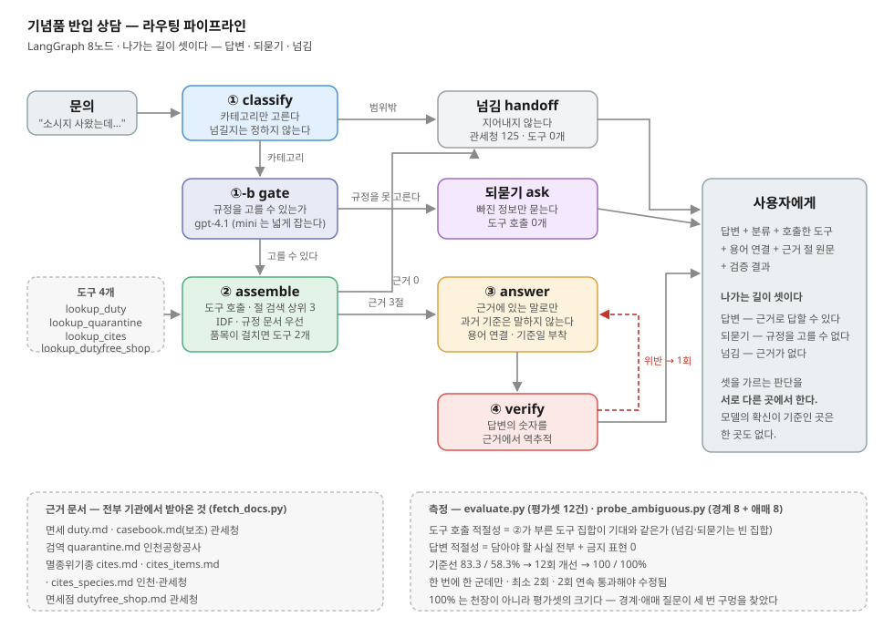

# 기념품 반입 상담 라우팅 에이전트

### ▶︎ [바로 써 보기](https://jubyeong-kim-souvenir-customs-agent-app-j8x6a9.streamlit.app/)

[](https://jubyeong-kim-souvenir-customs-agent-app-j8x6a9.streamlit.app/)

설치 없이 브라우저에서 바로 돕니다. 예시 버튼을 눌러 보세요 —
**💬** 는 되물어서 대화가 이어지는 문의, **↩** 는 근거 자료에 답이 없어 넘기는 문의입니다.

해외에서 산 기념품을 한국으로 들여올 때의 문의에 답한다.
문의를 네 영역으로 나누고, 영역마다 **다른 근거 문서**를 조립해 그것만으로 답하고, 근거에 없는 숫자가 섞였는지 기계적으로 검사한다.

```
문의 ──→ ① 분류 ──→ ①-b 되묻기 판단 ──→ ①-c 어휘 정규화 ──→ ② 근거 조립
                          │                                      │
                          └─→ 되묻기                    ③ 답변 ──→ ④ 검증 ──→ 답
                                                                  │
         범위밖 ─────────────────→ 넘김 ←── 근거 없음      위반 → 재작성 1회
```



## 왜 이 주제인가

근거 문서가 **실제로 존재하고 길기** 때문이다. 관세청·인천공항공사에 공개된 안내가 카테고리별로 나눠 넣을 만큼 있고,
무엇보다 **문서에 없는데 모델이 자신 있게 틀리는 영역**이다 — 면세 한도 금액, 나라별 예외, 직구 기준과 휴대 기준의 혼동.
검증 단계가 장식이 아니라 일을 한다.

## 카테고리와 근거

| 카테고리 | 답하는 것 | 근거 문서 | 도구 |
|---|---|---|---|
| `면세` | 면세 범위, 초과 시 과세, 자진신고 감면, 미신고 가산세 | `duty.md`, `casebook.md` | `lookup_duty` |
| `검역` | 축산물·식물·야생동물 반입 가부와 검역 신고 | `quarantine.md` | `lookup_quarantine` |
| `멸종위기종` | CITES 규제 범위(가공품 포함)와 허가·처벌 | `cites.md`, `cites_items.md` | `lookup_cites` |
| `면세점` | 입국장면세점 구매 한도와 공제 순서 | `dutyfree_shop.md` | `lookup_dutyfree_shop` |
| `범위밖` | 넘김 — 항공사 수하물, 비자, 출국 반출, 상대국 규정 | 없음 | 부르지 않음 |

### 나가는 길이 셋이다

| 길 | 어디서 정하나 | 기준 |
|---|---|---|
| 답변 | — | 근거로 답할 수 있다 |
| 되묻기 | `gate` | 품목이 특정되지 않아 **적용할 규정이 갈린다** |
| 넘김 | `classify`(범위밖) · `assemble`(검색 점수 0) | 근거가 없다 |

**모델의 확신이 기준인 곳은 한 곳도 없다.** 되물은 뒤 사용자가 답하면 앞 턴의 정보를 합쳐 판정한다
(멀티턴). 이때 이전 대화는 **배경으로 따로** 넘기고 이번 발화에 이어 붙이지 않는다 — 이어 붙이면
봇이 이전 질문에 답한다.

나눈 근거는 **처리 방식이 다르다는 것**이다. 면세는 금액·수량 계산, 검역은 품목별 가부 판정,
멸종위기종은 허가서 존재 여부, 면세점은 공제 순서. 답변의 모양 자체가 다르다.

## 문서는 기억이 아니라 기관에서 받아온다

`docs/` 의 모든 파일은 `fetch_docs.py` 가 `sources.yaml` 의 URL에서 받아온 것이다. 손으로 쓰지 않는다.

```bash
python fetch_docs.py          # 전부 다시 받는다
python fetch_docs.py 검역      # 카테고리 하나만
```

면세 한도나 검역 금지 품목은 **바뀐다.** 기억으로 쓴 숫자로 평가셋을 만들면 정답부터 틀린다.
각 문서 머리에 출처 URL과 받은 날짜가 박히고, 답변 끝에는 `(받은 날짜 기준)` 이 자동으로 붙는다.

검역만 사건 기반(해외 가축전염병 발생)으로 **수시로** 바뀌므로, 그 카테고리만 답변에 *출국 전 재확인* 문구가 강제된다.
나머지(면세·CITES·면세점)는 법 개정 주기라 느리다.

> `law.go.kr` 과 `qia.go.kr` 은 본문이 자바스크립트로 그려져 받아지지 않았다.
> 기억으로 채우지 않고 **같은 내용을 싣는 관세청·인천공항공사 정적 페이지로 출처를 바꿨다.**

## 다루지 않는 것

**"해외 → 한국 입국" 기준만** 다룬다. 출국 시 반출(문화재·CITES 수출허가), 외국인의 사후면세·택스리펀,
한국 물품을 상대국에 들고 갈 때의 규정은 근거 문서가 없어 넘긴다.

## 돌려보기

```bash
pip install -r requirements.txt
cp .env.example .env            # OPENAI_API_KEY 를 채운다
python fetch_docs.py            # 근거 문서 받기

python context.py               # 검색·조립 자체 점검 (API 불필요)
python agent.py                 # 그래프 배선·검증 규칙 자체 점검 (API 불필요)
python agent.py "술 몇 병까지 면세되나요"

python evaluate.py --self-check # 채점기 자체를 먼저 검증한다
python evaluate.py              # 평가셋 12건 측정
python evaluate.py --repeat 3   # 3회 돌려 **안정성**(분산)까지 본다

python probe_ambiguous.py       # 어려운 문의 24건 (경계·애매·제품명) — 채점하지 않는다
python probe_multiturn.py       # 되묻고 이어지는 대화 5건
streamlit run app.py            # 데모 화면 (대화형)
```

`python agent.py` 와 `python context.py` 는 **API 키 없이도** 돈다. 클론해서 바로 배선을 확인할 수 있다.

### 웹에 올리기 (Streamlit Community Cloud)

저장소를 공개로 올린 뒤 <https://share.streamlit.io> 에서:

1. **New app** → 이 저장소 · 브랜치 `main` · 파일 `app.py`
2. **Advanced settings → Secrets** 에 키를 넣는다 (저장소에는 넣지 않는다)

   ```toml
   OPENAI_API_KEY = "sk-..."
   ```
3. Deploy

서버에서는 `fetch_docs.py` 를 돌리지 않는다 — **커밋된 `docs/` 를 읽는다.**
문서를 새로 받으려면 로컬에서 `python fetch_docs.py` 후 커밋하면 자동 재배포된다.

같은 공유기 안에서만 보여 주면 되는 자리라면 서버를 띄운 채
`http://<내 IP>:8501` 로 접속하면 된다 (`--server.address 0.0.0.0` 필요).

## 측정

두 지표를 따로 잰다.

- **도구 호출 적절성** — 실제 호출한 도구 집합이 기대와 정확히 일치하면 1점. 넘기기 문항은 빈 집합이 정답이다.
- **답변 적절성** — `must_include` 를 전부 담고 `must_not` 을 하나도 어기지 않으면 1점. 채점기는 표현이 아니라 사실을 본다.

채점기를 쓰기 전에 `--self-check` 로 **채점기 자체를 검증**한다. 모범 답안·틀린 답안·부분 답안 셋을 넣어
각각 만점·전부위반·부분점수가 나오는지 본다. 여기서 안 맞으면 이후 숫자는 전부 무의미하다.

회차별 기록은 [실험기록.md](실험기록.md), 판단의 근거는 [REPORT.md](REPORT.md).

## 파일

| | |
|---|---|
| `sources.yaml` | 근거 문서의 출처·소관기관·갱신주기 |
| `fetch_docs.py` | 출처에서 받아 `docs/*.md` 로 저장 (HTML·PDF) |
| `context.py` | 절 쪼개기 · 검색 · 카테고리별 도구 4개 |
| `prompts.py` | 분류 지침 · 답변 규칙 · 표기 규칙 |
| `agent.py` | LangGraph 파이프라인 |
| `evaluate.py` | 두 지표 + 채점기 자체 검증 |
| `app.py` | Streamlit 데모 |
| `data/goldenset.json` | 평가셋 12건 (채점용) |
| `data/fewshot.json` | 프롬프트 예시 4건 (채점하지 않음) |

## 주의

실습용이다. 답변은 `docs/` 의 안내 자료에서만 나오고, 실제 통관은 관세청 고객지원센터(125)에 확인해야 한다.
