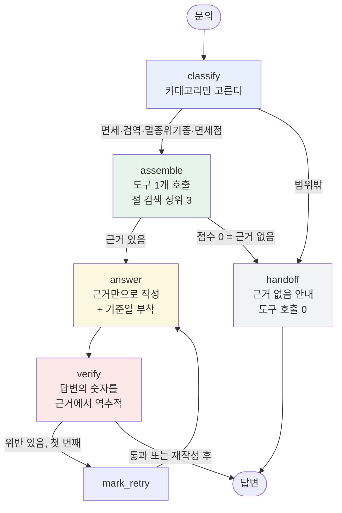

# REPORT — 기념품 반입 상담 라우팅 에이전트

## 1. 주제와 근거 문서

**주제: 해외에서 산 기념품을 한국으로 들여올 때의 문의.**

주제를 고르는 조건은 카테고리 수가 아니라 **근거 문서였다.** 처음 후보는 두 개였다.

| 후보 | 왜 떨어졌나 / 붙었나 |
|---|---|
| 카드뉴스 SNS 챗봇 | 답할 변동값이 없다. 상품도 주문도 재고도 없어 도구가 놀고, 근거 문서로 쓸 약관이 존재하지 않는다 |
| 지도 기반 기념품 플랫폼 이용 문의 | 우리가 준비 중인 서비스라 **약관·매뉴얼이 아직 없다.** 오늘 그걸 창작해야 하고, 지어낸 문서로 만든 평가셋은 "왜 그렇게 정했는가"가 텅 빈다 |
| **기념품 반입 규정** (선택) | 관세청·인천공항공사에 **공개 문서가 길게 존재**하고, 카테고리별로 나뉘고, **모델이 자신 있게 틀리는 영역**이다 |

세 번째가 조건 셋을 다 만족했다. 특히 조건 3("문서에 근거가 없는데 그럴듯하게 답할 수 있는 질문") —
면세 한도 금액, 나라별 예외, 그리고 아래에서 다룰 **직구 기준과 휴대 기준의 혼동**이 이 영역에 널려 있다.

### 문서는 기억이 아니라 기관에서 받아왔다

`docs/` 의 모든 파일은 `fetch_docs.py` 가 `sources.yaml` 의 URL에서 받아온 것이다. 한 줄도 손으로 쓰지 않았다.

이유는 단순하다. **면세 한도와 검역 금지 품목은 바뀐다.** 모델의 지식은 특정 시점에 멈춰 있어
틀린 숫자를 쓸 수 있고, 틀린 숫자로 만든 평가셋은 **정답부터 틀린다.** 그러면 이후 측정이 전부 무의미해진다.

받는 과정에서 막힌 것과 바꾼 것:

| 원하던 출처 | 결과 | 대응 |
|---|---|---|
| `law.go.kr` 관세법 시행규칙 (시행일이 박혀 있어 이상적) | iframe 안쪽까지 갔으나 본문이 자바스크립트로 그려져 189자만 추출 | 포기 |
| `qia.go.kr` 농림축산검역본부 | 깊은 페이지가 전부 홈페이지로 돌아옴 | **인천국제공항공사 검역 안내**로 교체 (같은 내용, 정적) |
| `cites.org` | 403 | **인천공항본부세관 CITES 안내**로 교체 |

기억으로 채우지 않고 **출처를 바꿨다.** 이것이 이 프로젝트에서 가장 먼저 정한 규칙이었다.

### 갱신 주기 — 검역만 빠르다

| 문서 | 바뀌는 속도 | 계기 |
|---|---|---|
| **검역** | **수시 (며칠 단위도)** | 해외 가축전염병(ASF·AI·구제역) 발생 시 해당국 축산물 반입 즉시 차단 |
| 면세 한도 | 몇 년 | 관세법·시행규칙 개정 |
| CITES | 2~3년 | 당사국총회(CoP) |

그래서 자동 갱신 구조는 **검역 하나 때문에** 필요하다. 나머지 셋에 붙이는 것은 낭비다.
오늘은 `sources.yaml` + `fetch_docs.py` 수동 실행까지만 만들고, 각 문서 머리에 **받은 날짜**를 박았다.
답변 끝에는 `(2026-09-17 기준)` 이 자동으로 붙고, **검역 카테고리만** *출국 전 재확인* 문구가 강제된다.

### "사람들이 바뀐 줄 모른다" 문제

현재 규정 페이지는 *"지금 이렇다"* 만 적고 *"예전엔 달랐다"* 는 적지 않는다.
그래서 봇에게 과거를 말하게 하면 **반드시 지어낸다.** 두 가지로 대응했다.

1. **답변 규칙에 금지 조항**: *"네가 따로 아는 과거 기준이나 '예전에는 ~였다'는 말은 하지 않는다.
   질문자가 틀린 전제를 깔고 물어도, 그 전제를 반박하지 말고 근거의 현재 기준을 그대로 알려 준다."*
2. **상담 사례집 추가**: 관세청 「2026 관세행정 민원상담 사례집」(1,093쪽 PDF)에서 여행자 휴대품 관련 10쪽만 뽑았다.
   실제 민원이라 **사람들이 어디서 헷갈리는지가 질문 형태로** 들어 있다.

그런데 이 사례집이 뜻밖의 것을 드러냈다 — 4장에서 다룬다.

---

## 2. 카테고리 설계

### 나눈 근거

문서의 목차가 아니라 **처리 방식의 차이**로 나눴다. 답변의 모양 자체가 다르다.

| 카테고리 | 답이 어떤 모양인가 |
|---|---|
| `면세` | 금액·수량 계산 ("800달러 이하", "2L 그리고 400달러") |
| `검역` | 품목별 가부 판정 ("생과실은 수입금지", "육가공품은 증명서 있어야") |
| `멸종위기종` | 허가서 존재 여부와 처벌 조항 |
| `면세점` | 공제 **순서** (무엇이 먼저 차감되는가) |
| `범위밖` | 답하지 않고 넘김 |

### 매핑표

| 카테고리 | 근거 문서 | 출처 | 절 수 |
|---|---|---|---|
| `면세` | `duty.md` | 관세청 여행자 휴대품 통관 | 3 |
| | `casebook.md` | 관세청 민원상담 사례집 (PDF 10쪽) | 10 |
| `검역` | `quarantine.md` | 인천국제공항공사 동식물 검역 안내 | 9 |
| `멸종위기종` | `cites.md` | 인천공항본부세관 CITES 안내 | 3 |
| | `cites_items.md` | 인천본부세관 CITES 부분품·가공품 목록 | 3 |
| `면세점` | `dutyfree_shop.md` | 관세청 입국장면세점 | 5 |
| `범위밖` | — | 없음 (도구를 부르지 않는다) | 0 |

`cites_items.md` 는 처음부터 있던 것이 아니다. 기준선을 재고 나서 **문서가 부족하다는 것이 드러나 보강**한 것이다 (실험기록 #1).

**절(`##`)이 근거의 최소 단위다.** 관공서 페이지는 제목이 `<h>` 태그가 아니라 굵은 한 줄이라
휴리스틱으로 절을 잘랐고, 600자가 넘으면 줄 경계에서 쪼갰다. 이 절이 그대로 데모 화면의 "근거" 칸에 보인다.

---

## 3. 평가셋 설계

`data/goldenset.json` — **12건** (면세 3 · 검역 3 · 멸종위기종 2 · 면세점 2 · 범위밖 2).

### 만든 방식과 그 한계

강사님이 사람이 직접 만들라고 한 이유는 분명하다 — **모델이 만들면 모델이 아는 범위만 물어본다.**
실제로는 시간에 밀려 **Claude 가 초안을 쓰고 사람이 검수하는 방식**으로 만들었다. 정직하게 적어 둔다.

다만 초안이 문서를 보고 쓰였고, 각 항목의 근거를 추적할 수 있게 했다:

| 항목 | 무엇을 근거로 정했나 |
|---|---|
| `query` | 문서의 각 절이 다루는 사실 하나씩에 대응. 실제 여행자 말투로 |
| `expected_tools` | 카테고리 → 도구가 1:1이므로 카테고리 판정이 곧 기대 도구. 넘기기 문항은 **빈 배열** |
| `must_include` | **문서 절에서 그대로 가져왔다.** 판단이 들어가지 않는다 |
| `must_not` | 문서를 안 읽었을 때 나오기 쉬운 값. 아래 |

### `must_not` 을 어떻게 골랐나

세 종류를 섞었다.

1. **틀린 숫자** — "기본 면세범위가 600달러" (실제 800달러), "가산세가 20%" (실제 40%)
2. **다른 제도의 숫자** — "주류 면세 150달러 이하 1병(1L)". 이것이 **해외직구 기준**이고 여행자 휴대품은 2L·400달러다
3. **그럴듯한 완화** — "소량이면 신고 안 해도 된다", "진공포장이면 괜찮다", "개인 소장용은 허가 불필요"

3번이 특히 잘 걸린다. 모델이 친절해지려고 "소량은 괜찮습니다" 를 붙이는 경향이 있다.

### 평가용과 예시용을 갈랐다

`data/fewshot.json` 4건을 **따로** 두고 프롬프트 예시로만 쓴다. 채점하지 않는다.
32건 정답셋에서 100%를 받아도 **같은 셋을 보고 고친 결과**면 과적합이다 — 지난 과제에서 배운 것이다.

### 범위 밖 2건을 우리 약점으로 채웠다

이 봇은 **"해외 → 한국 입국"** 기준만 다룬다. 그래서 넘기기 문항을 그 경계 바로 밖에 뒀다.

- *"한국에서 산 홍삼을 미국 갈 때 가져가도 되나요?"* — 반출 + 상대국 규정. 근거 없음
- *"비행기 수하물은 몇 kg까지 실을 수 있어요?"* — 항공사 규정. 근거 없음

둘 다 **모델이 아는 척하기 딱 좋은** 질문이다. 넘기기가 정답인 문항이 없으면 넘기기 경로를 아예 잴 수 없다.

---

## 4. 측정 결과

(측정 표는 [실험기록.md](실험기록.md) 에 회차별로 있다. 아래는 요약과 원인 분석.)

### 먼저: 자(尺)가 틀려 있었다

기준선을 재려고 처음 돌렸을 때 **도구 83.3% / 답변 25.0%** 가 나왔다. 실패 목록이 이상했다.

```
금지 어김 ['모든 식품류는 예외 없이 검역 대상이라고 답하지 않았다']
근거없는 숫자 ['09', '17', '2026']
```

두 곳이 망가져 있었다.

| 무엇 | 어떻게 망가졌나 | 고친 것 |
|---|---|---|
| 채점기 | `list[str]` 로 "담은 사실"을 받으니 판단 근거 문장을 목록에 넣었다. 어긴 것이 없으면 `["없음"]` 을 돌려주어 위반 1건으로 세어지고, **안 어긴 항목까지** "~라고 답하지 않았다" 로 어김 목록에 들어갔다 | 항목을 번호로 주고 `list[bool]` 로만 받는다 |
| 가드레일 | 답변 끝에 `(2026-09-17 기준)` 을 붙이라고 **내가 지시했는데**, 검증이 그 `09`·`17` 을 근거에 없는 숫자로 잡아 재작성까지 시켰다 | 기준일을 근거에 있는 값으로 센다 |

**자가 틀린 상태의 25.0% 는 기준선이 아니다.** 이건 개선 회차로 세지 않고, 고친 자로 다시 쟀다.

> 교훈: `--self-check`(채점기 자체 검증)를 미리 만들어 둔 것이 값을 했지만, 3건짜리 자체 검증은
> `["없음"]` 만 잡고 "~라고 답하지 않았다" 는 놓쳤다. **평가셋 전체를 한 번 돌려야** 드러나는 종류의 버그였다.

### 기준선 (#0)

| 회차 | 도구 호출 적절성 | 답변 적절성 | 실패 건 |
|---|---|---|---|
| base-1 | 10/12 = **83.3%** | 7/12 = **58.3%** | D1 D2 D3 C1 X1 |
| base-2 | 10/12 = **83.3%** | 7/12 = **58.3%** | D1 D2 D3 C1 X1 |

두 번이 **완전히 같았다** (`temperature=0`). 지난 과제에서 같은 코드로 ±3건이 흔들렸던 것과 달라,
이 평가셋에서는 1건 차이도 신호로 읽을 수 있다.

### 실패 원인 분류

| 건 | 카테고리 | 원인 | 분류 |
|---|---|---|---|
| D1 | 면세 | 사례집의 **해외직구(발송) 기준** 「150불 이하 1병(1L)」을 인용. 휴대품 기준 「2L·400달러」는 `duty.md` 에 있는데 검색이 안 가져왔다 | **근거 선택 오류** |
| D2 | 면세 | 800달러를 빠뜨렸다 (근거에는 있다) | 사실 누락 |
| D3 | 면세 | 「2년 내 2회 이상 60%」를 빠뜨렸다 | 사실 누락 |
| C1 | 멸종위기종 | `cites.md` 에 품목 예시가 **하나도 없었다** — 악어·지갑·가죽·핸드백·가공품 전부 0건 → 검색 점수 0 → 넘김 | **문서 부족** |
| X1 | 범위밖 | 「한국에서 산 홍삼을 미국 갈 때」를 `검역` 으로 분류해 도구를 불렀다 | 분류 오류 |

D1 과 C1 은 **사례집을 받아본 시점에 미리 예상했고 그대로 나왔다.**

D1 이 이 프로젝트에서 가장 값진 발견이다. 사용자가 "주류가 2병에서 병 제한이 사라졌다"고 기억하는 혼동의 정체가
**옛 정보가 아니라 제도가 두 개인 것**이었다 — 직접 들고 오는 것(2L·400달러)과 해외에서 발송되는 것(150달러·1병).
같은 "술 면세"라는 말 아래 숫자가 완전히 다르고, 관세청 사례집에도 둘이 나란히 실려 있다.

### 개선 #1 — 멸종위기종 문서 보강

- **고친 곳 하나**: `sources.yaml` 에 `cites_items.md` 추가 (인천본부세관 CITES 부분품·가공품 목록)
- **왜**: C1 은 검색 버그가 아니라 **문서에 걸릴 말이 없어서** 못 찾은 것이었다. 프롬프트로도 코드로도 풀리지 않는 종류다
- **손대지 않은 것**: 프롬프트, 검색 함수, 분류 지침 — 한 번에 한 군데만

| 회차 | 도구 호출 적절성 | 답변 적절성 | 실패 건 |
|---|---|---|---|
| 기준선 | 83.3% | 58.3% | D1 D2 D3 **C1** X1 |
| imp1-1 | **91.7%** | **66.7%** | D1 D2 D3 X1 |
| imp1-2 | **91.7%** | **66.7%** | D1 D2 D3 X1 |

**판정: 수정됨** — 2회 연속 통과, 다른 건에 부작용 없음 (실패 목록이 정확히 C1 하나만 줄었다).

검색 함수도 프롬프트도 건드리지 않았다. **문서가 없어서 못 찾던 것을 문서로 고쳤다.**
"말로 안 고쳐지면 말이 문제가 아니다" 의 한 단계 위였다 — 코드도 문제가 아니었다.

### 다음에 손댈 순서 (고정)

지난 과제에서 27회 고쳐 81%, 동료는 5회 고쳐 100%였다. 차이는 실력이 아니라 **손대는 순서**였다.
케이스별 코드 관문을 쌓지 말고 **프롬프트의 일반 규칙 → 도구 → 그 다음에야 코드 관문.**

1. **D2·D3 사실 누락** — 답변 규칙 한 줄을 더 세게 (일반 규칙이 여러 건을 쓸어담는다)
2. **D1 근거 선택** — 사례집의 직구 관련 쪽을 `쪽키워드` 로 걸러내거나, 같은 카테고리 안에서 규정 문서에 가중치
3. **X1 분류 오류** — 분류 지침에 "한국에서 나가는 것은 범위밖" 한 줄. 코드 관문은 최후

---

## 5. 파이프라인 구조도



### State

```python
class State(TypedDict, total=False):
    query:        str        # 문의
    category:     str        # ① 판정 결과
    evidence:     list       # ② 조립된 절 (제목·본문·출처·기준일)
    tools_called: list       # ② 호출한 도구 이름 → 지표 1의 측정 대상
    answer:       str        # ③ 답변
    violations:   list       # ④ 근거에 없는 숫자
    retried:      bool       # 재작성 1회 제한
```

### 설계에서 가장 신경 쓴 두 가지

**① 분류와 넘기기를 떼어 놓았다.**
`classify` 는 카테고리만 고르고, 넘길지 말지는 `assemble` 이 **근거를 실제로 못 찾았을 때** 정한다.
모델의 확신이 아니라 **근거의 존재**가 넘기기의 기준이다. 모델에게 "확신 없으면 넘겨라"고 하면
맞게 답하던 것까지 넘어가 자동화율을 갉아먹는다 — 지난 과제에서 5건을 그렇게 잃었다.

**② 재작성은 1회로 못 박았다.**
`verify` 가 위반을 잡으면 무엇이 틀렸는지 알려 주고 한 번만 다시 쓰게 한다.
무한 재시도는 비용만 늘고, 두 번째에도 못 고치면 문제는 답변이 아니라 근거에 있다.

---

## 6. 데모 설계

`streamlit run app.py`

**답변만 보여주면 봇을 믿을 근거가 없다.** 그래서 답변 아래 네 칸을 항상 같이 보여준다.

| 칸 | 무엇을 | 왜 |
|---|---|---|
| ① 분류 | 어느 카테고리로 판정했는지 | 오답의 절반은 분류에서 갈린다 |
| ② 호출한 도구 | `lookup_*` 배지, 없으면 "호출 없음 — 넘김" | 넘김이 실패가 아니라 **설계된 동작**임을 보인다 |
| ③ 근거로 쓴 문서 부분 | 조립된 절 **원문 그대로**, 출처 URL과 기준일 | 답변을 문서와 눈으로 대조할 수 있다 |
| ④ 검증 | 통과 / 근거에 없는 숫자 / 재작성 여부 | 가드레일이 일하는 것을 보인다 |

그 밖에:

- **면책 배너를 상단에 고정** — 실제 법규를 답하므로 잘라내지 않았다. 관세청 125 안내
- **사이드바에 근거 문서 목록과 출처** + *"입국 시 반입 기준만 다룹니다"* 범위 명시
- **예시 질문 5개 버튼** — 4개 카테고리 + 범위 밖 하나. 넘김 동작을 누구나 바로 볼 수 있게

화면 캡처는 `docs/demo.png` 에 넣는다 (`streamlit run app.py` → 예시 버튼 "악어가죽 지갑…" 클릭 후 캡처).

실제 동작 확인 (개선 #1 이후, 기준선에서는 넘김 처리됐던 건):

```
문의    악어가죽 지갑을 기념품으로 샀는데 문제 없을까요?
답변    악어가죽은 CITES 규제대상 동식물에 해당할 수 있으므로, CITES 야생동식물의
        국외 반출 및 국내 반입 시 살아 있는 것뿐 아니라 죽은 것, 부분품 및 가공품까지
        허가를 받아야 합니다. (2026-09-17 기준)
① 분류            멸종위기종
② 호출한 도구      lookup_cites
③ 근거로 쓴 문서   개요 — CITES는『멸종위기에 처한 야생동식물종의…』 · 2026-09-17 기준
④ 검증            통과 — 답변의 모든 숫자가 근거에 있습니다
```

---

## 7. 프로젝트 회고

### 가장 공들인 곳 — 문서를 받아오는 층

코드량으로는 `fetch_docs.py` 와 `sources.yaml` 이 가장 작은데 시간은 가장 많이 썼다.
법제처·검역본부·CITES가 차례로 막히고, PDF 는 띄어쓰기가 한자(`堺`)로 추출되고, 관공서 페이지는 `<h>` 태그가 없어
절을 휴리스틱으로 잘라야 했다.

그래도 이 층을 붙인 것이 이 프로젝트의 중심이었다. **"문서를 기억으로 쓰지 않는다"** 는 규칙이
평가셋의 정답을 지켰고, 파이프라인이 도는 것을 확인한 첫 실행에서 봇이 틀린 답을 했을 때
*"모델이 이상하다"* 가 아니라 *"검색이 사례집 절을 골랐다"* 까지 바로 짚을 수 있었다.

### 두 번째 — 재기 전에 자를 검증한 것

`--self-check` 를 먼저 만든 덕에 채점기 버그를 두 번(`["없음"]`, 문장 삽입) 잡았다.
**자를 안 고치고 25.0% 를 기준선으로 적었다면** 이후 모든 개선 판정이 거짓이 됐을 것이다.
동시에 한계도 봤다 — 3건짜리 자체 검증은 평가셋 전체를 돌려야 나오는 버그를 놓친다.

### 보완하고 싶은 것

| | |
|---|---|
| **검역 문서 자동 갱신** | 검역만 수시로 바뀐다. GitHub Actions 로 주 1회 `fetch_docs.py 검역` 을 돌려 변경 시 커밋하면, 바뀐 날짜가 이력으로 남는다 |
| **제도 구분을 봇이 알게** | 「휴대 반입」과 「해외직구 발송」은 다른 제도인데 문서가 섞여 있다. 절에 제도 표시를 달거나 카테고리를 쪼개야 한다 (D1의 근본 원인) |
| **출국·반출과 상대국 규정** | 지금은 "해외 → 한국 입국"만 다룬다. 문화재 반출허가, 외국인 사후면세, 상대국 입국 규정이 다음 단계 |
| **검색 함수** | 조사 제거가 규칙 기반이라 "악어가죽"처럼 붙은 말을 못 쪼갠다. 후보 문서가 늘면 형태소 분석기나 IDF 가중치로 올린다 |
| **평가셋을 사람 손으로 다시** | 지금은 Claude 초안 + 사람 검수다. 실제 문의 로그가 쌓이면 거기서 뽑아 다시 만들어야 한다 |

### 처음 생각과 달라진 것

카테고리를 "문서의 목차대로" 나누려 했지만, 받아온 문서가 목차대로 생기지 않아
**처리 방식의 차이**로 다시 나눴다. 그리고 `멸종위기종` 카테고리는 문서를 다 받은 뒤에도
정작 품목 예시가 없어서 **기준선을 재고 나서야** 부족함이 드러났다.

문서를 먼저 받고 카테고리를 나중에 정한 순서가 옳았다. 반대로 했다면
있지도 않은 문서를 전제로 카테고리를 짜 놓고 마지막에 무너졌을 것이다.
