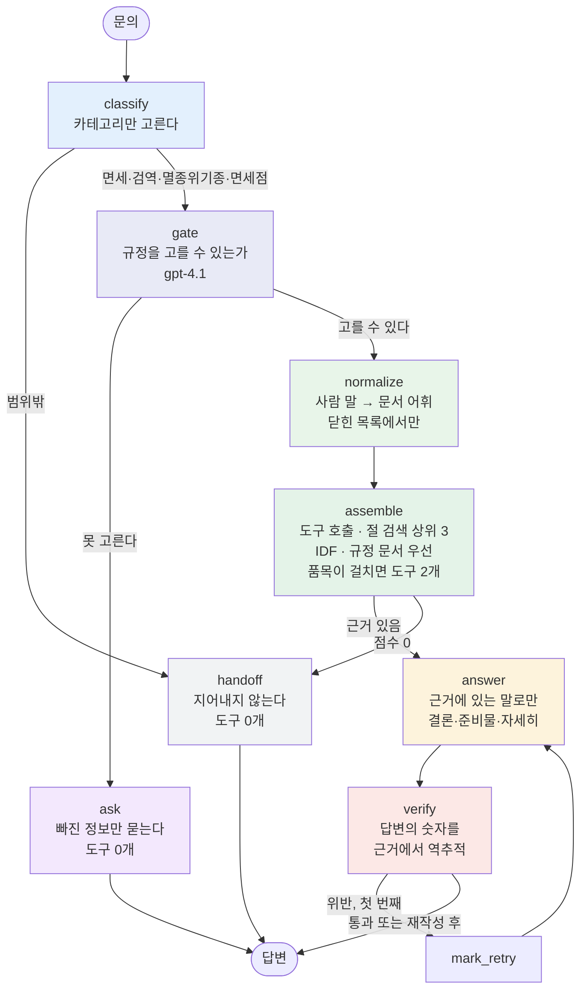
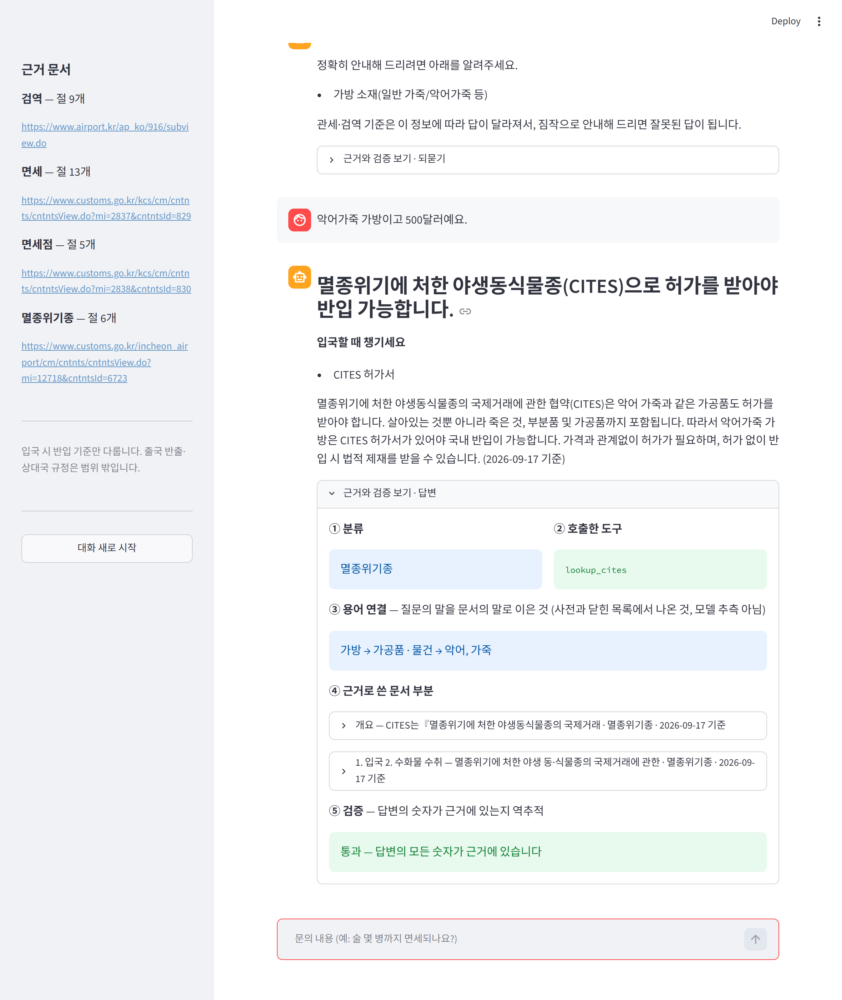

# REPORT — 기념품 반입 상담 라우팅 에이전트

> 해외에서 산 기념품을 한국으로 들여올 때의 문의에 답한다.
> 문의를 네 영역으로 나누고, 영역마다 다른 근거 문서를 조립해 **그것만으로** 답하고,
> 근거에 없는 숫자가 섞였는지 기계적으로 검사한다.
>
> **기준선 도구 83.3% / 답변 58.3% → 18회차 도구 100% / 답변 100% / 안정성 12/12**
>
> ▶︎ [바로 써 보기](https://jubyeong-kim-souvenir-customs-agent-app-j8x6a9.streamlit.app/)

---

## 1. 주제와 근거 문서

**주제: 해외에서 산 기념품을 한국으로 들여올 때의 문의.**

주제를 고르는 조건은 카테고리 수가 아니라 **근거 문서였다.**

| 후보 | 왜 떨어졌나 / 붙었나 |
|---|---|
| 카드뉴스 SNS 챗봇 | 답할 변동값이 없다. 상품도 주문도 재고도 없어 도구가 놀고, 근거로 쓸 약관이 존재하지 않는다 |
| 지도 기반 기념품 플랫폼 이용 문의 | 우리가 준비 중인 서비스라 **약관·매뉴얼이 아직 없다.** 오늘 그걸 창작해야 하고, 지어낸 문서로 만든 평가셋은 "왜 그렇게 정했는가"가 텅 빈다 |
| **기념품 반입 규정** (선택) | 관세청·인천공항공사에 **공개 문서가 길게 존재**하고, 카테고리별로 나뉘고, **모델이 자신 있게 틀리는 영역**이다 |

조건 3("문서에 근거가 없는데 그럴듯하게 답할 수 있는 질문")이 이 영역에 널려 있다 —
면세 한도 금액, 나라별 예외, 그리고 **직구 기준과 휴대 기준의 혼동**.

### 문서는 기억이 아니라 기관에서 받아왔다

`docs/` 의 모든 파일은 `fetch_docs.py` 가 `sources.yaml` 의 URL에서 받아온 것이다. 한 줄도 손으로 쓰지 않았다.

**면세 한도와 검역 금지 품목은 바뀐다.** 모델의 지식은 특정 시점에 멈춰 있어 틀린 숫자를 쓸 수 있고,
틀린 숫자로 만든 평가셋은 **정답부터 틀린다.** 그러면 이후 측정이 전부 무의미해진다.

| 원하던 출처 | 결과 | 대응 |
|---|---|---|
| `law.go.kr` 관세법 시행규칙 (시행일이 박혀 있어 이상적) | iframe 안쪽까지 갔으나 본문이 자바스크립트로 그려져 189자만 추출 | 포기 |
| `qia.go.kr` 농림축산검역본부 | 깊은 페이지가 전부 홈페이지로 돌아옴 | **인천국제공항공사 검역 안내**로 교체 |
| `cites.org` | 403 | **인천공항본부세관 CITES 안내**로 교체 |

기억으로 채우지 않고 **출처를 바꿨다.** 이것이 가장 먼저 정한 규칙이었다.

### 갱신 주기 — 검역만 빠르다

| 문서 | 바뀌는 속도 | 계기 |
|---|---|---|
| **검역** | **수시 (며칠 단위도)** | 해외 가축전염병(ASF·AI·구제역) 발생 시 해당국 축산물 반입 즉시 차단 |
| 면세 한도 | 몇 년 | 관세법·시행규칙 개정 |
| CITES | 2~3년 | 당사국총회(CoP) |

자동 갱신 구조는 **검역 하나 때문에** 필요하다. 각 문서 머리에 **받은 날짜**를 박고,
답변 끝에 `(2026-09-17 기준)` 이 자동으로 붙고, **검역 카테고리만** *출국 전 재확인* 문구가 강제된다.

### "사람들이 바뀐 줄 모른다" 문제

규정 페이지는 *"지금 이렇다"* 만 적고 *"예전엔 달랐다"* 는 적지 않는다. 그래서 봇에게 과거를
말하게 하면 **반드시 지어낸다.** 답변 규칙에 *"과거 기준이나 '예전에는 ~였다'는 말은 하지 않는다.
질문자가 틀린 전제를 깔고 물어도 반박하지 말고 근거의 현재 기준을 그대로 알려 준다"* 를 박았다.

관세청 「2026 관세행정 민원상담 사례집」(1,093쪽 PDF)에서 여행자 휴대품 관련 쪽만 뽑아 더했다.
**그런데 이 사례집이 뜻밖의 것을 드러냈다** — 4장 #7 회차.

---

## 2. 카테고리 설계

### 나눈 근거

문서의 목차가 아니라 **처리 방식의 차이**로 나눴다. 답변의 모양 자체가 다르다.

| 카테고리 | 답이 어떤 모양인가 |
|---|---|
| `면세` | 금액·수량 계산 ("800달러 이하", "2L 그리고 400달러") |
| `검역` | 품목별 가부 판정 ("생과실은 수입금지", "육가공품은 증명서 있어야") |
| `멸종위기종` | 허가서 존재 여부와 처벌 조항 |
| `면세점` | 공제 **순서** (무엇이 먼저 차감되는가) |
| `범위밖` | 답하지 않고 넘김 |

### 매핑표

| 카테고리 | 근거 문서 | 출처 기관 | 절 수 | 도구 |
|---|---|---|---|---|
| `면세` | `duty.md` | 관세청 여행자 휴대품 통관 | 3 | `lookup_duty` |
| | `casebook.md` (보조) | 관세청 민원상담 사례집 PDF | 10 | |
| `검역` | `quarantine.md` | 인천국제공항공사 동식물 검역 안내 | 9 | `lookup_quarantine` |
| `멸종위기종` | `cites.md` | 인천공항본부세관 CITES 안내 | 3 | `lookup_cites` |
| | `cites_items.md` | 인천본부세관 부분품·가공품 목록 | 3 | |
| | `cites_species.md` | 관세청 (CITES 절만 발췌) | 1 | |
| `면세점` | `dutyfree_shop.md` | 관세청 입국장면세점 | 5 | `lookup_dutyfree_shop` |
| `범위밖` | — | 없음 (도구를 부르지 않는다) | 0 | — |

`cites_items.md`·`cites_species.md` 는 처음부터 있던 것이 아니다. **기준선을 재고 나서
문서가 부족하다는 것이 드러나 보강**한 것이다 (#1·#10).

**절(`##`)이 근거의 최소 단위다.** 관공서 페이지는 제목이 `<h>` 태그가 아니라 굵은 한 줄이라
휴리스틱으로 절을 잘랐고, 600자가 넘으면 줄 경계에서 쪼갰다. 이 절이 그대로 데모의 "근거" 칸에 보인다.

---

## 3. 평가셋 설계

`data/goldenset.json` — **12건** (면세 3 · 검역 3 · 멸종위기종 2 · 면세점 2 · 범위밖 2).

### 만든 방식과 그 한계

강사님이 사람이 직접 만들라고 한 이유는 분명하다 — **모델이 만들면 모델이 아는 범위만 물어본다.**
실제로는 시간에 밀려 **Claude 가 초안을 쓰고 사람이 검수하는 방식**으로 만들었다. 정직하게 적어 둔다.

| 항목 | 무엇을 근거로 정했나 |
|---|---|
| `query` | 문서의 각 절이 다루는 사실 하나씩에 대응. 실제 여행자 말투로 |
| `expected_tools` | 카테고리 → 도구가 1:1. 넘기기·되묻기 문항은 **빈 배열** |
| `must_include` | **문서 절에서 그대로 가져왔다.** 판단이 들어가지 않는다 |
| `must_not` | 아래 세 종류 |

### `must_not` 세 종류

1. **틀린 숫자** — "기본 면세범위가 600달러" (실제 800달러), "가산세가 20%" (실제 40%)
2. **다른 제도의 숫자** — "주류 면세 150달러 이하 1병(1L)". 이것이 **해외직구 기준**이고 여행자 휴대품은 2L·400달러다
3. **그럴듯한 완화** — "소량이면 신고 안 해도 된다", "진공포장이면 괜찮다", "개인 소장용은 허가 불필요"

3번이 특히 잘 걸린다. 모델이 친절해지려고 "소량은 괜찮습니다" 를 붙이는 경향이 있다.

### 평가용과 예시용을 갈랐다

`data/fewshot.json` 4건을 **따로** 두고 프롬프트 예시로만 쓴다. 채점하지 않는다.

### 범위 밖 2건을 우리 약점으로 채웠다

이 봇은 **"해외 → 한국 입국"** 기준만 다룬다. 넘기기 문항을 그 경계 바로 밖에 뒀다 —
*"한국에서 산 홍삼을 미국 갈 때"*(반출+상대국), *"비행기 수하물 몇 kg"*(항공사 규정).
둘 다 **모델이 아는 척하기 딱 좋은** 질문이다. 넘기기가 정답인 문항이 없으면 넘기기 경로를 아예 잴 수 없다.

### 평가셋 밖에서 찔러 보는 29건

12건은 카테고리가 깔끔하게 갈리고 필요한 정보가 다 들어 있는 문항만 있다. 실제 문의는 그렇지 않다.
**채점하지 않고 «어디로 가는지» 만 보는** 질문 묶음을 따로 만들었다.

| 묶음 | 건수 | 무엇이 어려운가 | 실행 |
|---|---|---|---|
| 경계 | 8 | 분류가 두 영역에 걸친다 | `python probe_ambiguous.py 경계` |
| 애매 | 8 | 사람이 애매하게 말해 한 번 더 물어야 한다 | `python probe_ambiguous.py 애매` |
| 제품명 | 8 | 브랜드·외래어로 말한다 (비첸향·하몽·크로커딜) | `python probe_ambiguous.py 제품명` |
| 대화 | 5 | 되묻고 나서 이어진다 (2턴) | `python probe_multiturn.py` |

**이 29건이 12건이 만점인 상태에서 구멍을 일곱 번 찾아냈다.** 4장 마지막에 정리했다.

---

## 4. 측정 결과

### 두 지표

- **도구 호출 적절성** — 실제 호출한 도구 집합이 `expected_tools` 와 정확히 일치하면 1점.
  넘기기·되묻기 문항은 빈 집합이 정답이다. *필요한 근거를 안 읽은 것 · 관련 없는 근거를 훑은 것 ·
  넘겨야 하는데 지어낸 것*이 이 하나로 다 걸린다.
- **답변 적절성** — `must_include` 를 전부 담고 `must_not` 을 하나도 어기지 않으면 1점.
  채점기에게 **표현이 아니라 사실**을 보라고 명시했다.
- **안정성** (#18 에서 추가) — `--repeat N` 으로 N회 돌려 **문항별 통과 횟수**를 세고,
  N회 모두 같은 결과가 나온 문항의 비율을 본다. 앞의 둘은 «맞는가》를,
  이것은 «같은 질문에 같은 답을 주는가》를 본다.
  **#17 은 이 지표가 없어서 놓쳤다** — 12건 100% 인데 같은 질문이 5회 중 3회 틀렸다.
  현재 **안정성 12/12** (3회 반복).

### 먼저: 자(尺)가 틀려 있었다

기준선을 재려고 처음 돌렸을 때 **도구 83.3% / 답변 25.0%** 가 나왔다. 실패 목록이 이상했다.

```
금지 어김 ['모든 식품류는 예외 없이 검역 대상이라고 답하지 않았다']
근거없는 숫자 ['09', '17', '2026']
```

| 무엇 | 어떻게 망가졌나 | 고친 것 |
|---|---|---|
| 채점기 | `list[str]` 로 받으니 판단 근거 문장을 목록에 넣었다. 어긴 것이 없으면 `["없음"]` 을 돌려주어 위반 1건으로 세어지고, **안 어긴 항목까지** 어김 목록에 들어갔다 | 항목을 번호로 주고 `list[bool]` 로만 받는다 |
| 가드레일 | 답변 끝에 `(2026-09-17 기준)` 을 붙이라고 **내가 지시했는데**, 검증이 그 `09`·`17` 을 근거에 없는 숫자로 잡아 재작성까지 시켰다 | 기준일을 근거에 있는 값으로 센다 |

**자가 틀린 상태의 25.0% 는 기준선이 아니다.** 개선 회차로 세지 않고, 고친 자로 다시 쟀다.
`--self-check`(채점기 자체 검증)를 미리 만든 것이 값을 했지만, 3건짜리 자체 검증은
**평가셋 전체를 한 번 돌려야** 드러나는 버그를 놓쳤다.

---

### 종합 실험 기록표

측정 규칙(타협 없음): **한 번에 한 군데만** / **최소 2회** / **2회 연속 통과해야 "수정됨"** /
**1건 차이는 변화 없음** / **원복·회귀도 기록**. 회차별 원본 로그는 [실험기록.md](실험기록.md) 와 `runs/`.

| 회차 | 변경 대상 | 🚨 핵심 변경 이유 (Why) | 🛠 핵심 변경 내용 (What) | 도구 호출<br>적절성 | 답변<br>적절성 | 📝 성과 및 오답 메모 |
|:--:|---|---|---|:--:|:--:|---|
| **#0** | 코드 수정 없음 | 기준선 실측 및 실패 지점 파악 | 자(채점기·가드레일)를 고친 뒤 그대로 측정 | **83.3%**<br>(10/12) | **58.3%**<br>(7/12) | **[기준선]** 두 회차가 **완전히 같았다**(`temperature=0`) → 1건 차이도 신호로 읽을 수 있다<br>실패 D1 D2 D3 C1 X1 |
| **#1** | `sources.yaml`<br>(문서 보강) | `cites.md` 에 **품목 예시가 하나도 없었다** — 악어·지갑·가죽·핸드백·가공품 전부 0건. 검색 점수 0 → 넘김 | 인천본부세관 CITES **부분품·가공품 목록** 절을 `cites_items.md` 로 추가 | 91.7%<br>+8.4%p | 66.7%<br>+8.4%p | C1 수정됨. **검색 버그가 아니라 문서가 없어서** 못 찾은 것 — 말로도 코드로도 안 풀리는 종류 |
| **#2** | `context.py`<br>(`search`) | 통관 문서에서 `신고` 는 거의 모든 절에 나와 **절을 구분하지 못하는데** 빈도 합계가 점수를 지배. 「가산세 40%·60%」 절이 7위로 밀려 *"자료에 없습니다"* | 점수를 `빈도 × IDF` 로. 흔한 말의 가중치를 낮춘다 | 91.7% | 75.0%<br>+8.3%p | D2 수정됨. 처음엔 절 길이를 의심했으나 분포가 343~770자로 고르게 나와 **길이가 아니라 어휘**였다 |
| **#3** | `sources.yaml`<br>`context.py` | 면세 카테고리에 **사례집 10절 vs 규정 3절** — 점수와 무관하게 상위 3자리를 사례집이 채웠다 | 사례집에 `보조: true`. 규정 문서를 먼저 채우고 남는 자리에만 보조 | 91.7% | 83.3%<br>+8.3%p | D1 수정됨. **⚠️ 첫 시도에서 회귀** — 무조건 한 자리를 비워 보조 문서 없는 검역이 3절→2절로 줄어 Q2 가 깨졌다. `imp3-1` 의 83.3% 만 봤으면 통과시켰다. **목록으로 비교한 덕에 잡았다** |
| **#4** | `prompts.py`<br>(`CLASSIFY`) | 「홍삼을 미국 갈 때」를 품목만 보고 `검역` 으로 분류. 방향이 먼저다 | *"한국에서 **나가는** 이야기는 물건이 무엇이든 범위밖"* 한 줄 | **100%**<br>+8.3%p | 91.7%<br>+8.4%p | X1 수정됨. 도구 지표 만점 |
| **#5** | `prompts.py`<br>(`ANSWER`) | 「미신고 40%·60%」는 쓰면서 바로 옆 「자진신고 30% 경감」을 빠뜨림 | *"[근거]에 **나란히 놓인 두 경우**는 둘 다 쓴다. 질문이 한쪽만 물어도 다른 쪽을 알려 주는 것이 상담이다"* | **100%** | **100%**<br>+8.3%p | D3 수정됨. **3회 연속 만점** |
| **#6** | `context.py`<br>(`SYNONYMS`) | **시연에서** 「예전엔 술 2병까지…」 가 넘김. `술` 은 한 글자라 버려지고(`len<2`), 살려도 **문서는 `주류` 라 쓴다** | 사람 말 → 문서 말 사전. 단어 **앞머리**로만 맞춘다("미술품"이 새지 않게) | 100% | 91.7%<br>**⚠️ 회귀** | **원복하지 않았다.** `술`→`주류` 확장이 사례집의 직구 기준(150달러·1병) 절을 끌어올려 D1 이 도로 깨졌다. #3 은 함정을 **피했을 뿐 고친 게 아니었다** |
| **#7** | `sources.yaml`<br>(`쪽제외`) | 사례집 24쪽은 「해외에서 **발송되는**」 = **해외직구 기준**. 이 봇은 직접 들고 오는 경우만 다루는데 같은 "술 면세" 제목 아래 있다 | 그 쪽을 근거에서 제외 (`쪽제외`) | **100%** | **100%** | D1 근본 수정. **지우는 것이 아니라 범위를 맞추는 것** — 답하지 않는 제도의 문서는 애초에 근거가 아니다 |
| **#8** | `prompts.py`<br>(`CLASSIFY`) | #7 의 **반대 방향 오류** — 직구 문서를 뺐더니 직구 질문에 휴대품 기준(2L·400달러)을 답했다 | *"택배·배송대행·해외직구는 범위밖"* 한 줄 | **100%** | **100%** | **문서를 뺐으면 질문도 받지 말아야 한다** |
| **#9** | `context.py`<br>(`CROSS_CHECK`) | 「소시지 30달러, 면세 한도 안이면 괜찮죠?」 가 `면세` 로 분류돼 검역 문서를 못 보고 **"신고 없이 통과할 수 있다"** 고 답했다. 믿으면 과태료 | **금지·제한 품목 교차 조회** — 물건 자체가 막히는 품목이면 분류와 무관하게 그 영역도 같이 본다 | **100%** | **100%** | 경계 3번 수정. **분류는 "무엇을 묻는가"(금액)를 맞혔다. 답에 필요한 것은 "무엇을 가져오는가"(육가공품)였다** — 도구 하나라는 제약이 문제였고 프롬프트로는 못 고친다 |
| **#10** | `fetch_docs.py`<br>`prompts.py` | 「캐비어」 가 자료에 없다고 답했다. `철갑상어` 가 실린 페이지는 관세청 여행자 통관 안내 하나뿐이고 그건 이미 `duty.md` 로 면세에 쓰고 있었다 | ① `절키워드` — 페이지를 통째로 복사하지 않고 **CITES 절만** 떼어 옴<br>② `[용어 연결]` — 「캐비어 = 철갑상어」 는 문서에 없는 연결이므로 **우리가 만든 것임을 밝혀** 넘긴다 | **100%** | **100%** | 경계 4번 수정. 목록만 넣었을 때는 여전히 *"자료에 없다"* — 모델이 스스로 잇지 않은 것은 **옳은 태도**였다. `["CITES"]` 로 걸었더니 가산세 절까지 딸려와 좁혔다 |
| **#11** | `context.py`<br>`prompts.py` | 「입국장면세점 위스키도 술 면세 한도에?」 가 *"한도에 포함되지 않는다"* 로 **틀렸다.** 원인이 세 겹 | ① `RESTRICTED`→`CROSS_CHECK` 로 바꾸고 **별도 한도 품목**(술·담배·향수) 추가<br>② `[문서 용어]` — 「우선 공제」는 먼저 **차감**된다는 뜻<br>③ 한도가 **두 개**(800달러 / 2L·400달러)임을 갈라 적음 | **100%** | **100%** | 경계 2번 부분 수정. 이름을 바꾼 이유 — `RESTRICTED` 에 술이 들어가면 **"술은 금지 품목"** 으로 읽힌다. 틀린 이름은 나중에 더 비싸다.<br>국산/해외를 나눠 말하는 문장은 아직 어색하지만 **거기서 멈췄다** (프롬프트 더 쌓기 = 27회차 함정) |
| **#12** | `agent.py`<br>(`gate`·`ask`) | **애매 8건 전부 그냥 답하고 되묻기 0건.** 「가방 하나 샀어요」 에 금액도 재질도 안 묻고 *"신고할 물품 없으면 제출 안 해도"*, 「동물 가죽 제품」 에 소가죽까지 규제로 답 | 되묻기 경로 추가. 기준은 하나 — **어느 규정을 적용할지 고를 수 있는가.** `ask` 는 **도구를 하나도 부르지 않는다** | **100%** | **100%** | 되묻기 0건 → 5건.<br>**⚠️ 첫 시도 100→66.7%** — 소시지·망고·김치까지 되물었다(PLAYBOOK 이 경고한 그대로).<br>기준을 좁혀도 91.7% — **프롬프트에 「망고」를 적어 놓았는데도** 되물었다. 키워드 규칙을 쌓을 수 있었지만 **하지 않고** 게이트만 `gpt-4.1` 로 올렸다 |
| **#13** | `context.py`<br>`agent.py`<br>(`normalize`) | **제품명 8건 중 4건 넘김** — 비첸향·하몽·크로커딜, 그리고 대조군 두리안까지. 두리안은 `CROSS_CHECK` 에 적어 뒀는데도 **문서에 그 말이 없어** 점수 0 | ① 문서가 실제로 쓰는 **닫힌 어휘 목록**(34개)에서 모델이 고르게 함<br>② 정규화가 품목을 특정하면 **그 말이 있는 절만** 근거로 씀 | **100%** | **100%** | 넘김 4건 → 0건. **사전에 적는 것과 문서 어휘로 이어 주는 것은 다른 일**이었다.<br>비첸향은 근거가 **1위로 맞게 왔는데도** 답변 모델이 2위 식물 검역 절을 골라 *"식물류"* 라고 답했다. 프롬프트로 네 번 막아도 안 돼서 **충돌하는 절을 애초에 주지 않는** 쪽으로 갔다 |
| **#14** | `agent.py`<br>`context.py` | 「하몽」 이 `면세` 로 분류된 경우 근거가 **찾아지긴 해서** 정규화가 돌지 않고 **검역증명서 안내가 빠졌다** | 정규화를 조회 **전에 항상** 돌리고, 그 결과를 교차 조회에도 쓴다 | **100%** | **100%** | 손으로 적은 품목 사전과 모델 정규화가 **이어졌다.**<br>**⚠️ 넣다가 두 번 깨뜨림** — ① `가공품` 이 「육**가공품**」에 부분 일치해 검역 문의까지 CITES 호출 ② 제도 어휘(`자진신고`)로 절을 걸러 D3 회귀(100→91.7%, 2회). `ITEM_TERMS`/`RULE_TERMS` 로 갈라 고침 |
| **#15** | `agent.py`<br>`prompts.py` | 되묻기(#12)를 붙였더니 **되묻고 끝났다.** 사용자가 답할 곳이 없었다 | 멀티턴. **이전 대화를 이번 발화에 이어 붙이지 않는다** — 분류·게이트·답변에는 `[이전 대화]` 로 **따로**, 검색에는 **합친다** | **100%** | **100%** | 대화 5건 전부 통과. 「소가죽이에요」 → *"CITES 대상에 해당하지 않습니다"*, 「그럼 술은요?」 → 되묻지 않고 주류 한도로 이어받음.<br>**찾는 일과 답하는 일에 다른 문맥이 필요하다** (1턴 78% / 2턴 47% 의 큰 몫이 이것) |
| **#16** | `agent.py`<br>(`Reply`) | 답변이 **한 덩어리 줄글**이었고 사람들은 그걸 읽지 않는다 | **결론 · 준비물 · 자세히** 세 토막을 구조화 출력으로 받는다. 「준비물」은 **손에 들고 가는 것**만 | **100%** | **100%**<br>(4회 중 1회 91.7%) | 마크다운으로 부탁하지 않고 **구조로 받아** 서식이 흔들리지 않는다.<br>**편차가 0 이던 상태에서 ±1건이 생겼다** — 결론 압축 중 「밀수출입죄」 조항이 빠질 때가 있다. 1건 차이라 규칙상 변화 없음이지만 기록해 둔다 |

| **#17** | `agent.py`<br>`fetch_docs.py` | **배포하고 나서 찾았다.** 같은 코드·같은 문서인데 「비첸향」 이 *"신고 대상에 해당하지 않아 증명서 없이 반입 가능"* 으로 **가부가 뒤집혔다**(5회 중 3회). 비첸향은 육포다 — 믿으면 과태료 | ① 답변 모델을 `gpt-4.1` 로<br>② `unfold_tables()` — 표를 `- 헤더: 값` 줄로 풀어 써서 덧붙인다 | **100%** | **100%** | 5회 돌려 단계별로 갈랐다 — 분류·정규화·근거는 **5/5 동일**, 흔들린 곳은 답변 한 곳.<br>**⚠️ 모델만 올렸을 때 망고가 깨졌다**(5/5 일관되게 *"신고하면 가능"*). 원인은 「수입금지대상」 열이 파이프로 납작하게 눌린 것 — **표를 납작하게 만든 건 우리 파이프라인**이라 문서 쪽을 고쳤다.<br>숫자 검증으로는 못 잡는다 — **틀린 것이 숫자가 아니라 판정** |

| **#18** | `evaluate.py`<br>`app.py` | #17 이 **평균으로는 보이지 않았다.** 12건 100% 인데 「비첸향」 은 5회 중 3회 틀렸다. 평균은 «내가 물어본 12건》 만 말하고, 그 12건조차 **한 번 재서 나온 값**이었다 | ① `--repeat N` — 문항별 통과 횟수 + **흔들린 문항** + **안정성** 지표<br>② 데모에 **「← 마지막 질문 취소」** — 되묻기가 있으니 한 턴만 무를 곳이 필요하다 | **100%** | **100%** | **안정성 12/12** (3회 모두 같은 결과).<br>지표가 셋이 되었다 — 맞는가(둘) · **같은 답을 주는가**(하나).<br>흔들린 문항이 있으면 *"5회 더 돌려 어느 단계가 흔들리는지 가른다"* 까지 출력한다. #17 에서 그 순서로 범인을 찾았기 때문이다 |

**손댄 곳의 성격**: 문서 5 · 검색 3 · 프롬프트 5 · 구조 6 · 모델 2 · 형식 1 · 측정 2.
**케이스별 코드 관문은 한 개도 넣지 않았다.**

> 측정 도구를 고친 것이 두 번이다 — #0 직전(채점기·가드레일)과 #18(분산).
> 둘 다 **잘못 재고 있었다는 것을 알아차린** 회차이고, 둘 다 점수를 올리지 않았다.
> 그래도 이 두 번이 나머지 17회차를 믿을 수 있게 만들었다.

> 지난 과제에서 27회 고쳐 81%, 동료는 5회 고쳐 100%였다. 차이는 실력이 아니라 **손대는 순서**였다.
> 케이스마다 코드 관문을 쌓지 말고 **프롬프트의 일반 규칙 → 도구 → 그 다음에야 코드 관문.**
> 이번에 코드 관문을 넣고 싶은 순간이 세 번 있었고(#12 망고, #13 브랜드 목록, #16 결론 압축)
> 세 번 다 다른 길을 골랐다 — 모델 교체, 닫힌 어휘 목록, 그리고 «고치지 않고 기록».

### 기준선 실패 5건의 원인 분류

| 건 | 카테고리 | 원인 | 분류 |
|---|---|---|---|
| D1 | 면세 | 사례집의 **해외직구 기준** 「150불 이하 1병(1L)」을 인용 | **근거 선택 오류** |
| D2 | 면세 | 800달러를 빠뜨렸다 (근거에는 있다) | 사실 누락 |
| D3 | 면세 | 「2년 내 2회 이상 60%」를 빠뜨렸다 | 사실 누락 |
| C1 | 멸종위기종 | `cites.md` 에 품목 예시가 **하나도 없었다** | **문서 부족** |
| X1 | 범위밖 | 「홍삼을 미국 갈 때」를 `검역` 으로 분류 | 분류 오류 |

D1 이 가장 값진 발견이다. 사용자가 "주류가 2병에서 병 제한이 사라졌다"고 기억하는 혼동의 정체가
**옛 정보가 아니라 제도가 두 개인 것**이었다 — 직접 들고 오는 것(2L·400달러)과
해외에서 발송되는 것(150달러·1병). 관세청 사례집에도 둘이 나란히 실려 있다.

### 12건 100% 가 말해 주지 않는 것

| 무엇이 찾아냈나 | 무엇을 | 회차 |
|---|---|---|
| 평가셋 12건 | 근거 선택, 사실 누락, 분류 방향 | #1~#5 |
| **시연 (사람이 직접)** | 한 글자 품목, 사람 말 ↔ 문서 말 | #6·#7 |
| **경계 질문 8건** | 한 문의 두 영역, 경로 구분, 문서에 없는 연결, 문서 용어 오독 | #8~#11 |
| **애매 질문 8건** | 되묻는 경로가 아예 없었다 | #12 |
| **제품명 질문 8건** | 브랜드·외래어를 문서 어휘로 이을 방법이 없었다 | #13·#14 |
| **대화 5건** | 되묻고 나서 이어지지 않았다 | #15 |
| **사람이 읽어 보고** | 답이 맞아도 **읽히지 않으면** 상담이 아니다 | #16 |
| **배포하고 나서** | 같은 질문이 **돌릴 때마다 가부가 뒤집혔다.** 평균이 아니라 분산 | #17 |

**여덟 번 다 12건이 만점인 상태에서 나왔다.** 100% 는 천장이 아니라 **평가셋의 크기**다.
그리고 #16 은 평가셋으로 **잴 수조차 없는** 문제였다 — 두 지표는 «사실이 담겼는가》만 본다.

**12건은 이제 개선용이 되어 버렸다.** 같은 셋을 보고 16회 고친 결과이므로 과적합일 수 있다.
다만 고친 것들이 케이스별 땜질이 아니라는 점은 말할 수 있다 — IDF, 규정 문서 우선, 방향·경로 규칙,
교차 조회, 닫힌 어휘 정규화. 전부 12건 밖에서도 작동하는 **일반 규칙**이다.
확인하려면 **고치는 동안 한 번도 보지 않은 문항**으로 다시 재야 한다. 다음 작업 1순위다.

---

## 5. 파이프라인 구조도




### State

```python
class State(TypedDict, total=False):
    query:        str     # 이번 발화
    history:      list    # [(사용자, 봇), …] — 배경이고 답할 대상이 아니다
    category:     str     # ① 분류 결과
    missing:      list    # ①-b 되물을 것 (있으면 ask 로)
    terms:        list    # ①-c 문서 어휘로 바꾼 품목
    normalized:   bool
    evidence:     list    # ② 조립된 절 (제목·본문·출처·기준일)
    tools_called: list    # ② 호출한 도구 → 지표 1의 측정 대상
    answer:       str     # ③ 답변 (세 토막을 합친 글)
    reply:        dict    # ③ {결론, 준비물, 자세히}
    violations:   list    # ④ 근거에 없는 숫자
    retried:      bool    # 재작성 1회 제한
```

### 설계에서 가장 신경 쓴 세 가지

**① 나가는 길이 셋이고, 셋을 가르는 판단이 서로 다른 곳에 있다.**

| 길 | 어디서 정하나 | 기준 |
|---|---|---|
| 답변 | — | 근거로 답할 수 있다 |
| 되묻기 | `gate` | 품목이 특정되지 않아 **적용할 규정이 갈린다** |
| 넘김 | `classify`(범위밖) · `assemble`(검색 점수 0) | 근거가 없다 |

**모델의 확신이 기준인 곳은 한 곳도 없다.** 모델에게 "확신 없으면 넘겨라"고 하면 맞게 답하던 것까지
넘어가 자동화율을 갉아먹는다 — 지난 과제에서 5건을 그렇게 잃었고, 이번 #12 에서도 한 번 재현했다(100→66.7%).

**② 판단마다 모델을 따로 고른다.**
분류는 `gpt-4.1-mini`, **되묻기 판단·정규화·답변은 `gpt-4.1`**.
되묻기는 mini 가 «품목이 특정되면 조건부로 답한다》를 못 지켜 망고·고기까지 되물었다.
프롬프트를 네 번 고쳐도 안 됐고, 키워드 규칙을 쌓는 대신 그 판단만 큰 모델로 올렸다.

**③ 재작성은 1회로 못 박았다.**
무한 재시도는 비용만 늘고, 두 번째에도 못 고치면 문제는 답변이 아니라 근거에 있다.

---

## 6. 데모 설계

```bash
streamlit run app.py
```



*되묻기 → 사용자가 답함 → 이어서 판정하는 두 턴. 마지막 턴의 근거 칸만 펼쳐진다.*

**답변만 보여주면 봇을 믿을 근거가 없다.** 그래서 답변마다 다섯 칸을 같이 보여준다.

| 칸 | 무엇을 | 왜 |
|---|---|---|
| ① 분류 | 어느 카테고리로 판정했는지 | 오답의 절반은 분류에서 갈린다 |
| ② 호출한 도구 | `lookup_*` 배지. 없으면 "되묻기" 또는 "넘김" | 둘 다 실패가 아니라 **설계된 동작**임을 보인다 |
| ③ 용어 연결 | 「가방 → 가공품」 「물건 → 악어, 가죽」 | **사전과 닫힌 목록에서 나온 것**이지 모델 추측이 아님을 보인다 |
| ④ 근거로 쓴 문서 부분 | 조립된 절 **원문 그대로**, 출처 URL과 기준일 | 답변을 문서와 눈으로 대조할 수 있다 |
| ⑤ 검증 | 통과 / 근거에 없는 숫자 / 재작성 여부 | 가드레일이 일하는 것을 보인다 |

그 밖에 신경 쓴 것:

- **대화형** (`st.chat_input`) — 되묻기가 있으므로 이어서 답할 수 있어야 한다.
  **「← 마지막 질문 취소」** 로 한 턴만 무를 수 있다 (전부 지우는 「대화 새로 시작」 과 따로)
- **답변을 세 토막으로** — 결론을 먼저 크게, 준비물을 목록으로, 긴 설명은 그 아래
- **면책 배너를 상단에 고정** — 실제 법규를 답하므로 잘라내지 않았다. 관세청 125 안내
- **사이드바에 근거 문서와 출처 URL** + *"입국 시 반입 기준만 다룹니다"* 범위 명시
- **예시 버튼에 표시** — 💬 는 되물어서 대화가 이어지는 문의, ↩ 는 넘기는 문의.
  넘김과 되묻기가 고장이 아니라는 것을 누가 봐도 알 수 있게
- 캡처는 `python capture_demo.py` 로 자동 생성한다(설치된 Edge 사용). **두 턴을 잡는다** —
  한 턴만 잡으면 되묻기가 고장처럼 보인다

---

## 7. 프로젝트 회고

### 가장 공들인 곳 — 문서를 받아오는 층

코드량으로는 `fetch_docs.py` 와 `sources.yaml` 이 가장 작은데 시간은 가장 많이 썼다.
법제처·검역본부·CITES가 차례로 막히고, PDF 는 띄어쓰기가 한자(`堺`)로 추출되고,
관공서 페이지는 `<h>` 태그가 없어 절을 휴리스틱으로 잘라야 했다.

그래도 이 층이 이 프로젝트의 중심이었다. **"문서를 기억으로 쓰지 않는다"** 는 규칙이 평가셋의
정답을 지켰고, 봇이 틀린 답을 했을 때 *"모델이 이상하다"* 가 아니라
*"검색이 사례집 절을 골랐다"* 까지 바로 짚을 수 있었다.

### 두 번째 — 재기 전에 자를 검증한 것

`--self-check` 를 먼저 만든 덕에 채점기 버그를 두 번 잡았다.
**자를 안 고치고 25.0% 를 기준선으로 적었다면** 이후 16회차의 모든 판정이 거짓이 됐을 것이다.

### 세 번째 — 회귀를 점수가 아니라 목록으로 잡은 것

16회차 중 **네 번 회귀를 만들었다** (#3 Q2, #6 D1, #12 검역 4건, #14 D3).
그중 #3 은 점수가 **올라간** 회차였다 — `imp3-1` 83.3% 만 봤으면 통과시켰을 것이다.
**목록에 없던 Q2 가 새로 들어온 것**이 보여서 잡았다.

> 측정 규칙에서 «점수가 아니라 실패한 케이스 목록으로 비교한다》 가 가장 값을 한 한 줄이었다.

### 고치지 않기로 한 것도 결과다

- **경계 2번**(입국장면세점 위스키)의 국산/해외 구분 문장이 아직 어색하다.
  근거에는 사실이 다 들어와 있고 남은 것은 모델이 두 문장을 잇는 방식이다.
  프롬프트 규칙을 더 쌓는 것이 **27회차의 함정**이라 멈췄다 — 다음엔 답변 모델을 올려서 잰다
- **#16 의 ±1건 편차**도 고치지 않고 적었다. 1건 차이는 규칙상 «변화 없음》이다

`실험기록.md` 에 **「손대지 않기로 한 것」 12줄**을 따로 남겼다. 다음 사람이 같은 함정을 다시 밟지 않게.

### 보완하고 싶은 것

| | |
|---|---|
| **검증용 평가셋** | 29건(경계·애매·제품명·대화)을 정답과 함께 `data/holdout.json` 으로. 되묻기 문항은 `expected_tools: []` 에 `되묻기: true` 를 더해 넘김과 구분해야 한다 |
| **2턴을 지표로 재기** | 지금 두 지표는 단일 턴만 본다. 지난 과제에서 2턴이 1턴보다 31%p 낮았다 |
| **검역 문서 자동 갱신** | 검역만 수시로 바뀐다. Actions 로 주 1회 `fetch_docs.py 검역` 을 돌려 변경 시 커밋하면 바뀐 날짜가 이력으로 남는다 |
| **제도 구분을 봇이 알게** | 「휴대 반입」과 「해외직구 발송」은 다른 제도인데 문서가 섞여 있다. 지금은 직구 쪽을 **빼서 피했을 뿐** 구분한 것이 아니다 |
| **출국·반출과 상대국 규정** | 지금은 "해외 → 한국 입국"만 다룬다. 문화재 반출허가, 외국인 사후면세, 상대국 입국 규정이 다음 단계 |
| **어휘를 문서에서 뽑기** | `SYNONYMS`(30) · `CROSS_CHECK`(57) · `DOC_TERMS`(34) 는 손으로 적었다. 문서 어휘와 자동으로 맞추는 편이 낫다 |
| **평가셋을 사람 손으로 다시** | 지금은 Claude 초안 + 사람 검수다. 실제 문의 로그가 쌓이면 거기서 뽑아 다시 만들어야 한다 |

### 처음 생각과 달라진 것

카테고리를 "문서의 목차대로" 나누려 했지만, 받아온 문서가 목차대로 생기지 않아
**처리 방식의 차이**로 다시 나눴다. `멸종위기종` 은 문서를 다 받은 뒤에도 정작 품목 예시가 없어서
**기준선을 재고 나서야** 부족함이 드러났다.

문서를 먼저 받고 카테고리를 나중에 정한 순서가 옳았다. 반대로 했다면 있지도 않은 문서를 전제로
카테고리를 짜 놓고 마지막에 무너졌을 것이다.

그리고 **한 번 100% 를 찍은 뒤에 일곱 번 더 구멍이 나온 것**이 이 프로젝트에서 배운 가장 큰 것이다.
지표는 «내가 물어본 것》만 답한다. 물어보지 않은 것은 사람이 직접 써 보거나,
경계에 걸치는 질문을 일부러 만들어야 나온다.
