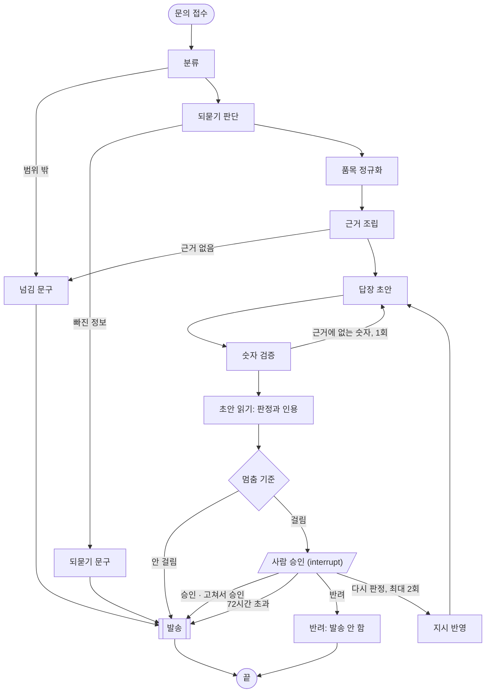
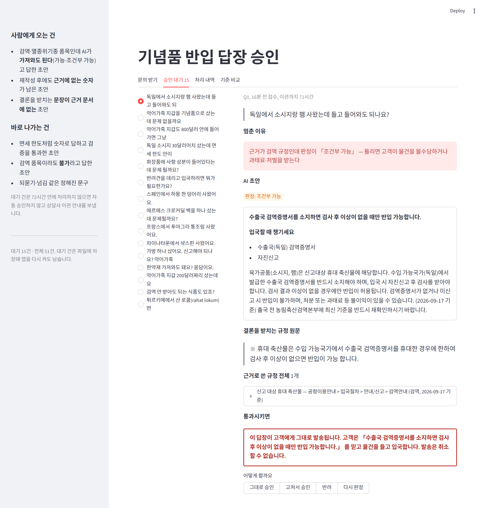
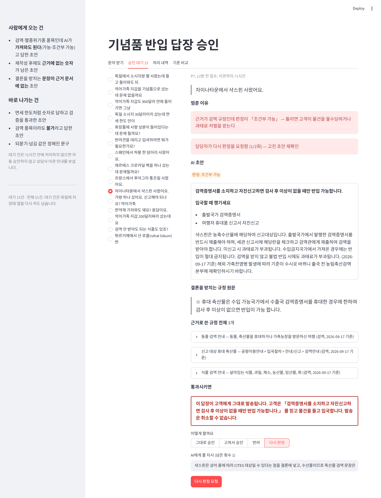
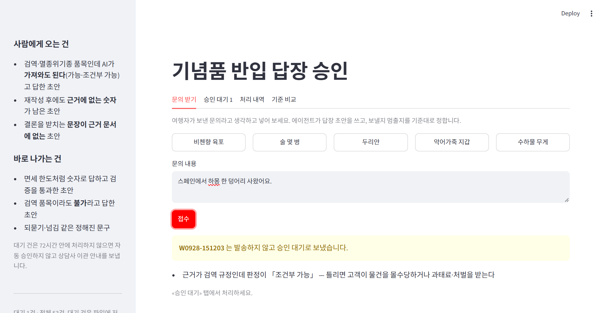
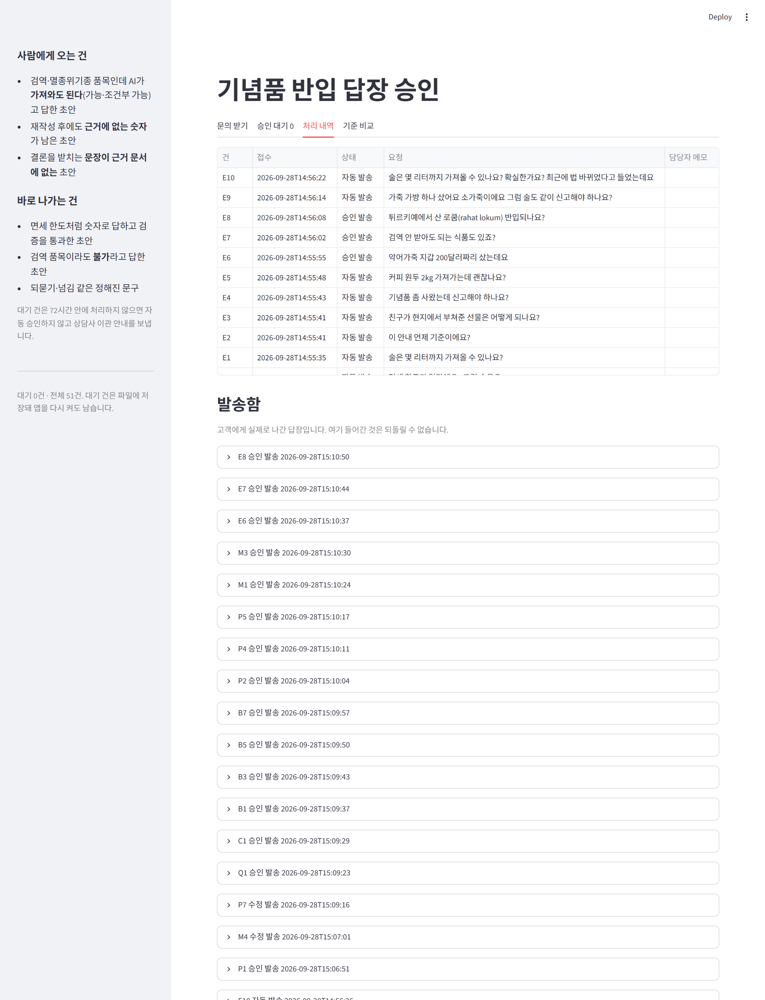

# 사람이 승인하는 답장 발송 — 설계와 결과

## 1. 주제와 고른 이유

**자동화한 일.** 여행자가 보낸 기념품 반입 문의에 답장을 보낸다. 이 저장소 루트에는 관세청·검역 안내 자료만으로 답하는 상담 파이프라인(분류 → 되묻기 판단 → 품목 정규화 → 근거 조립 → 답변 → 숫자 검증)이 이미 있다. 그 뒤에 **발송** 단계를 붙이고, 발송 바로 앞에 사람의 승인을 넣었다.

**결과가 바깥으로 나가는 단계.** `send` 하나다. 답장이 고객에게 가면 고객은 그 안내대로 물건을 들고 입국한다. 검역·멸종위기종 물건에 "가져와도 된다"가 잘못 나가면 공항에서 몰수되고, 과태료나 밀수 처벌까지 받을 수 있다. 보낸 답장은 되돌릴 수 없다.

**정확도만으로 안 되는 이유.** 루트 파이프라인은 평가셋을 모두 맞혔지만, 같은 문의를 여러 번 돌리면 답이 흔들린다. 이번에도 "면세 한도 넘은 걸 공항에서 그냥 버리고 나와도 되나요?"(B8)를 6번 돌렸더니 2번은 근거 문서 어디에도 없는 "공항에서 폐기할 수 있습니다"를 결론으로 썼다. 숫자가 아니라서 숫자 검증도 통과했다. 틀린 답이 나가기 전에 막을 자리가 따로 있어야 한다.

**전부 사람이 보지 않는 이유.** 문의의 상당수는 "술 몇 병까지 면세되나요?" 같은 한도 문의다. 그 답의 숫자는 코드가 근거 문서와 글자 단위로 대조한다. 이런 건까지 사람이 보면 자동화하는 의미가 없다.

## 2. 파이프라인 구조

`classify`부터 `verify`까지는 루트 `agent.py`의 노드를 그대로 가져다 쓴다. `read`·`risk`·`review`·`redo`·`reject`·`send`는 `hitl/hitl.py`에 있다.

**상태(State)가 흐르는 순서**

| 키 | 쓰는 노드 | 쓰임 |
|---|---|---|
| `query`, `received_at` | 접수 | 문의 원문, 접수 시각(72시간 규칙) |
| `category`, `missing`, `terms` | classify, gate, normalize | 영역, 되물을 정보, 문서 어휘로 바꾼 품목 |
| `evidence`, `tools_called` | assemble | 근거 절(영역·기준일·출처·본문) |
| `answer`, `reply` | answer | 초안 글, 결론·준비물·자세히 |
| `violations`, `retried` | verify | 근거에 없는 숫자, 재작성 여부 |
| `판정`, `인용`, `인용확인` | read | 가능·조건부 가능·불가·해당 없음·자료에 없음, 결론을 받치는 근거 문장, 그 문장이 근거에 정말 있는지 |
| `reasons` | risk | 멈춘 이유(사람이 읽는 문장) |
| `human` | review | 담당자의 답 `{action, text}` |
| `redo`, `instruction` | redo | 다시 판정 횟수, 담당자 지시 |
| `status`, `sent` | send, reject | 자동 발송·승인 발송·수정 발송·반려·기한초과 이관, 실제로 나간 글 |

**멈추고 이어가는 방식**

- `review` 노드는 `interrupt(payload)` 하나로만 되어 있다. `payload`가 곧 승인 화면의 내용이다.
- 담당자가 답하면 `Command(resume={"action": ..., "text": ...})`로 넣는다. 어느 건을 이어갈지는 `thread_id`(= 문의 ID)로 가린다.
- 체크포인터는 `SqliteSaver`(`hitl/runs/checkpoints.sqlite`)다. 메모리가 아니라 파일에 저장하므로 앱을 껐다 켜도 대기 건이 남는다. 대기 건을 하나 둔 채 서버를 재시작해서 그대로 남아 있는 것을 확인했다.
- 대기 목록은 `get_state(...).next`에 `review`가 남아 있는 건이다.
- 재개하면 멈췄던 `review`가 처음부터 다시 돈다. 그래서 `review` 안에는 바깥으로 나가는 동작을 두지 않았다. 발송은 `send` 노드에만 있다. `send`는 발송함(`outbox.jsonl`)에 같은 `thread_id`가 이미 있으면 다시 쓰지 않는다. 재시작 뒤 `send`가 한 번 더 돌아도 고객이 같은 답장을 두 번 받지 않는다.
- 사람 손을 한 번 탄 건은 다시 판정한 뒤에도 기준과 상관없이 `review`로 돌아온다. AI가 고친 초안을 사람이 보지 않고 내보내지 않기 위해서다.

**네 가지 응답과 그 뒤**

| 응답 | 그 뒤 |
|---|---|
| 그대로 승인 | 초안을 발송한다 |
| 고쳐서 승인 | 담당자가 고친 글을 발송한다 |
| 반려 | 발송하지 않는다. 사유를 반드시 적게 했다. 기준을 고칠 때 이 사유를 쓴다 |
| 다시 판정 | 지시를 붙여 초안을 다시 쓰고 숫자 검증·읽기·기준을 다시 거친 뒤 사람에게 돌아온다. 최대 2회 |

**72시간 규칙.** 대기 건을 72시간 동안 아무도 처리하지 않으면 자동 승인하지 않고, "담당 상담사가 직접 답변드리겠습니다" 안내를 보내고 `기한초과 이관`으로 닫는다. 기준에 걸린 건을 시간이 지났다고 내보내면 기준이 없는 것과 같기 때문이다.

## 3. 승인 기준과 그 이유

### 3-1. 사람이 봐야 하는 건

기준을 재려면 정답이 있어야 한다. 루트의 평가 문의 51건(골든 12, 검증 29, 외부 10)을 합쳐 `cases.json`을 만들고, 한 건마다 "사람이 봐야 하나"를 붙였다. 규칙은 하나다.

> **틀린 답이 나가면 고객이 물건을 몰수당하거나 과태료·처벌을 받는 건.** 정답이 검역·CITES 조건(증명서·허가·금지)에 걸리는 건이다.

51건 중 21건이다. 육가공품(소시지·하몽·비첸향·푸아그라), 생과실(망고·두리안), CITES 품목(악어가죽·사향·웅담·산호·캐비어·샥스핀), 반려견, 커피 생두가 여기 들어간다. 김치·떡(Q3), 소가죽(M4), 로쿰(E8)은 뺐다. 틀려도 "검역 받으세요", "허가 받으세요"처럼 조심하는 쪽으로 틀리기 때문이다.

### 3-2. 채택한 기준 세 가지

모두 코드로 계산한다. 모델이 자기 답을 얼마나 확신하는지는 쓰지 않는다.

| 기준 | 계산 | 막으려는 위험 |
|---|---|---|
| **위험 품목에 허용 판정** | (근거에 검역·멸종위기종 절이 있음 **또는** 품목이 그 영역 어휘) **그리고** 판정이 가능·조건부 가능 | 틀린 "가져와도 된다" → 몰수·과태료·처벌 |
| **근거에 없는 숫자** | 1회 재작성 뒤에도 근거에 없는 숫자가 남음 | 틀린 한도·세율을 고객이 그대로 믿는다 |
| **결론을 받치는 문장 없음** | 읽기 모델이 옮겨 온 근거 문장이 근거 본문에 글자 그대로 없음. 결론이 스스로 "자료에 없다"고 하면 제외 | 숫자가 아닌 규정이나 절차를 지어냈다 |

첫 기준에 신호가 둘인 이유가 있다. "영역"은 검색이 검역 절을 붙였는지를 보고, "품목"은 물건 이름이 검역·CITES 어휘인지를 본다. "독일 소시지 30달러, 면세 한도 안이면 괜찮죠?"처럼 금액을 묻지만 실제로는 검역이 막는 문의는 검색이 면세 쪽으로 빗나갈 수 있다. 품목 신호는 그럴 때를 대비한 보험이다.

### 3-3. 자동으로 처리되는 건과 사람이 안 봐도 되는 이유

| 자동 처리되는 건 | 예 | 괜찮은 이유 |
|---|---|---|
| 면세·면세점 한도 답변 | D1 "술 몇 병까지?" → 2L·400달러 | 숫자는 코드가 근거와 대조하고, 틀린 숫자가 남으면 둘째 기준에 걸린다 |
| 검역 품목이라도 **불가**라고 답한 답변 | Q2 망고, P6 두리안, C2 산호 | 틀리더라도 "가져오지 마세요" 쪽이다. 고객이 물건을 두고 오거나 신고할 뿐 몰수·처벌로 가지 않는다 |
| 되묻기·넘김 문구 | V1 "이거 세금 내야 하나요?", X2 수하물 무게 | 판정이 없는 정해진 문구다. 모델이 지어낼 여지가 없다 |

### 3-4. 후보 기준 비교

같은 51건의 초안에 기준만 바꿔 적용했다(`python hitl/sweep.py --table`, 전체는 [criteria.md](criteria.md)).

- **놓침:** 사람확인 건인데 판정이 담긴 답장이 사람을 거치지 않고 나간 것
- **헛멈춤:** 볼 필요가 없는데 사람에게 온 것
- **틀린 답 자동 발송:** 채점기(루트 `evaluate.grade`)가 틀렸다고 본 답장 중 자동으로 나간 것. 놓침은 라벨로 세고, 이것은 실제 결과로 센다

| 기준 | 개입률 | 놓침 | 헛멈춤 | 틀린 답 자동 발송 |
|---|---:|---|---|---|
| 기준 없음 | 0/51 | 19건 | 0건 | 2건 (B2, E4) |
| 숫자만 | 0/51 | 19건 | 0건 | 2건 (B2, E4) |
| 인용만 | 1/51 | 19건 | 1건 (V7) | 2건 (B2, E4) |
| 영역만 | 22/51 | 1건 (E5) | 4건 (Q3, M4, E8, E9) | 2건 (B2, E4) |
| 영역·품목 | 22/51 | 1건 (E5) | 4건 (Q3, M4, E8, E9) | 2건 (B2, E4) |
| 영역·품목 × 허용 | 17/51 | 4건 (Q2, C2, P6, E5) | 2건 (M4, E8) | 2건 (B2, E4) |
| 영역·품목 × 허용 + 숫자 | 17/51 | 4건 (Q2, C2, P6, E5) | 2건 (M4, E8) | 2건 (B2, E4) |
| **영역·품목 × 허용 + 숫자 + 인용 (채택)** | **18/51** | 4건 (Q2, C2, P6, E5) | 3건 (V7, M4, E8) | 2건 (B2, E4) |
| 위 + 품목 미상 × 허용 | 26/51 | 3건 (Q2, C2, P6) | 10건 | 1건 (B2) |
| 전부 멈춤 | 51/51 | 0건 | 30건 | 0건 |

**읽는 법**

- **허용 조건을 붙이면** 22건이 17건으로 줄어 사람이 5건을 덜 본다. 대신 놓침이 1건에서 4건으로 는다. 늘어난 3건(Q2 망고, C2 산호, P6 두리안)은 모두 AI가 **"불가"라고 맞게 막은** 답이다. 채점기도 셋 다 맞다고 했다. 라벨로는 놓침이지만 나간 답이 사고가 아니다. 틀린 "가능"은 몰수·처벌이고 틀린 "불가"는 불편일 뿐이라는 비대칭을 받아들인 결과다.
- **숫자 기준은** 이번 51건에서 한 번도 걸리지 않았다. 재작성 1회로 모두 풀렸다. 그래도 둔다. 계산 비용이 없고, 걸리는 건은 틀린 한도가 그대로 나가는 경우라 치명적이다.
- **인용 기준은** V7 한 건을 더 멈췄다. "친구가 부탁해서 대신 사온 것은 면세대상에 해당하지 않습니다"는 근거 문서 어디에도 없는 규정이다. 채점기는 맞다고 했지만(금지 항목이 반대 방향이었다), 사람이 보고 반려했다. 라벨로는 헛멈춤이지만 실제로는 근거 없는 단정을 잡았다.
- **품목 미상 × 허용**(물건이 문서 어휘로 특정되지 않았는데 가능이라고 답함)을 더하면 E4·E5·B8이 잡힌다. 하지만 "면세 한도가 얼마예요?"처럼 규정만 묻는 문의(D2, S1, S2, V8, P8)가 전부 걸려 헛멈춤이 10건이 된다. 실제로 들어오는 문의는 이런 규정 질문이 대부분이라, 운영에서는 개입률이 크게 뛴다. 헛멈춤이 많으면 담당자가 읽지 않고 승인만 누르게 되므로 채택하지 않았다.
- 이 평가셋은 경계 문항 위주로 만든 것이라 사람확인이 41%다. 실제 문의에서의 개입률은 35%보다 낮을 것이다.

### 3-5. 설계하며 바꾼 것

처음 계획과 달라진 곳이 세 군데 있고, 셋 다 측정하다가 드러났다.

1. **판정 칸을 답을 쓰는 모델에 넣지 않는다.** 처음에는 답변 형식에 `판정`(가능·불가 등) 칸을 더했다. 1차로 51건을 돌렸더니 B8이 "공항에서 폐기할 수 있습니다"로 틀린 채 자동 발송됐다. 같은 문의를 따로 재 보니, 칸이 없을 때는 6번 중 2번 지어냈고, 칸을 넣으면 12번 중 11번 지어냈다. 칸의 위치를 바꾸거나 "자료에 없음" 선택지를 넣어도 같았다. 고를 칸이 생기면 모델이 가부를 먼저 정하고 그 가부에 맞춰 절차를 지어낸다. 그래서 루트 답변 형식은 원래대로 두고, 초안을 **다 쓴 뒤에** 따로 읽는 `read` 노드를 만들었다.
2. **읽기는 결론 한 줄만, 큰 모델로 한다.** 처음에는 mini에게 답장 전체를 주었다. 그랬더니 인용을 근거가 아니라 답장 본문에서 베껴 왔다. 지어낸 "폐기" 문장까지 인용으로 옮겼다. 망고 "가져올 수 없습니다"를 "가능"으로 읽기도 했다. 결론 한 줄과 근거만 주고 gpt-4.1로 바꾼 뒤 1차 초안 40건을 다시 읽혔다. 결론과 반대로 읽은 건은 눈으로 대조해서 찾지 못했다.
3. **"자료에 없음" 면제는 결론의 글자로 한다.** 지어낸 B8 결론을 읽은 모델이 판정을 "자료에 없음"으로 붙였다. 판정으로 면제하면 바로 그 건이 빠져나가므로, 결론 문장에 "자료에 없"다는 말이 실제로 있을 때만 면제한다.

### 3-6. 남은 위험

- **E5 커피 원두(놓침).** "면세범위 내면 가능합니다"라고 답하면서 식물검역을 빠뜨렸다. 품목 사전에 원두·생두가 없어서 품목 신호가 켜지지 않았다. 품목 사전에 식물류를 늘리면 막을 수 있다. 다만 이 51건을 보고 사전을 고치면 평가셋에 맞추는 것이 되므로, 이번에는 고치지 않고 적어만 둔다.
- **E4 막연한 문의(틀린 답 자동 발송).** "기념품 좀 사왔는데 신고해야 하나요?"에 되묻지 않고 "800달러 이하면 신고하지 않아도 됩니다"라고 답했다. 기념품이 육포라면 틀린 안내다. 멈춤 기준이 아니라 되묻기 판단(`gate`) 쪽에서 고쳐야 한다.
- **인용 기준의 한계.** 읽기 모델이 결론의 일부만 받치는 문장을 고르면 통과한다. 2차 실행의 B8은 "폐기할 수 있지만 세관에 신고하고 지시에 따라야 합니다"였다. 읽기 모델이 "신고서 제출" 문장을 골라서 "폐기" 부분은 검사되지 않았다. 같은 B8을 1차 초안에서는 잡았다.
- **채점기 오판.** B2는 초안이 맞는데(입국장면세점 위스키도 주류 한도에 합산된다) mini 채점기가 틀렸다고 했다. "틀린 답 자동 발송" 2건 중 실제로 틀린 것은 E4 하나다.

## 4. 실행 결과

**51건 접수** (`python hitl/sweep.py`)

| 결과 | 건수 |
|---|---:|
| 자동 발송 | 33 (답변 22, 되묻기 6, 넘김 5) |
| 승인 대기로 멈춤 | 18 |

**멈춘 18건 처리.** 담당자 역할은 Claude가 맡았다. 건마다 초안을 근거 문서와 대조하고 웹 데모 화면에서 직접 처리했다.

| 처리 | 건 | 이유 |
|---|---|---|
| 그대로 승인 (15) | Q1, C1, B1, B3, B5, B7, P1, P2, P4, P5, M1, M3, E6, E7, E8 | 결론의 조건(증명서·허가)이 근거 문장과 맞는다. E8(로쿰)은 "신고하고 검역 받으라"는 과하게 조심하는 답이라 발송해도 손해가 없다 |
| 고쳐서 승인 (1) | M4 소가죽 | 결론이 "규제대상이면 허가가 필요"로 흐리고, 준비물에 CITES 허가서를 넣었다. "일반 소가죽 제품은 CITES 허가 대상이 아닙니다"로 고쳐 보냈다 |
| 다시 판정 → 고쳐서 승인 (1) | P7 샥스핀 | 상어 종에 따라 CITES 대상일 수 있다는 안내가 빠졌다. 다시 판정을 지시했지만 AI가 반영하지 못했다. 근거 문서에 상어 CITES 문장이 없어서 "근거 안에서만 고쳐 쓴다"는 규칙과 부딪혔다. 담당자가 직접 고쳐 보냈다 |
| 반려 (1) | V7 친구 대신 구매 | 근거 문서에 대리 구매 물품의 면세 규정이 없다. 상담사가 관세청 기준을 확인해 직접 답하도록 반려했다 |

**다시 판정에서 배운 것.** 다시 판정은 근거 안에서 표현이나 강조를 바꾸는 데 쓰는 것이다. 근거에 없는 사실을 더해야 하면 사람이 고쳐서 승인하거나 반려해야 한다. 담당자가 헛걸음하지 않도록 다시 판정 칸 아래에 이 안내를 넣었다.

**보관과 재개.** 데모에서 새 문의 두 건을 넣었다. "술 몇 병"은 바로 발송되고, "하몽"은 대기로 갔다. 하몽이 대기 중인 상태로 서버를 재시작해도 "승인 대기 1"이 그대로 남았다.

## 5. 데모 화면 설계

**넣은 것**

- **요청 원문.** 고객이 쓴 말 그대로 넣었다. 담당자가 판단하는 대상은 AI의 요약이 아니라 고객의 질문이다.
- **멈춘 이유.** 걸린 기준을 문장으로 보여 준다. 예를 들어 "근거가 검역 규정인데 판정이 「조건부 가능」, 틀리면 고객이 물건을 몰수당하거나 과태료·처벌을 받는다". 무엇을 확인해야 하는지가 이 문장으로 정해진다.
- **AI 초안과 판정 배지.**
- **결론을 받치는 규정 원문 한 줄.** 담당자가 근거 문서를 따로 열지 않고, 결론과 원문 한 줄만 대조하면 되게 했다. 찾지 못했으면 경고를 띄운다.
- **근거 전체.** 기본은 접어 두었다. 필요할 때만 편다.
- **통과시키면.** 화면에서 유일하게 크게 튀는 요소다(빨간 테두리). "이 답장이 고객에게 그대로 발송됩니다. 고객은 「…」 를 믿고 물건을 들고 입국합니다. 발송은 취소할 수 없습니다." 이 줄을 읽고 나면 승인 버튼의 무게가 달라진다.
- **네 가지 응답.** 동작을 먼저 고르면 그 동작의 확정 버튼이 하나만 나온다. 버튼 이름이 일어날 일을 말한다("이 답장 발송", "반려하고 발송하지 않기"). 반려는 사유를 적어야 버튼이 켜지고, 다시 판정은 남은 횟수를 보여 준다.
- **접수 시각과 이관까지 남은 시간.**

**뺀 것**

- **분류 결과와 호출한 도구 이름.** 루트 채팅 데모에는 있지만 담당자의 판단에는 쓰이지 않는다.
- **모델 확신도.** 기준에 쓰지 않으니 보여 주면 오해만 산다.
- **한 번 눌러 승인하는 버튼.** 목록에서 바로 승인하면 내용을 읽지 않는다.

문의 받기와 처리 내역:

## 6. 프로젝트 회고

**가장 공들인 부분.** 판정 신호를 어디서 얻을지다. 판정 칸 하나를 더하는 것은 사소해 보였지만, 재 보니 답을 쓰는 모델을 더 대담하게 만들어 지어냄이 늘었다. 멈춤 기준을 위해 넣은 장치가 멈춰야 할 사고를 늘린 셈이다. 쓰는 일과 읽는 일을 나누고, 읽은 결과도 코드로 한 번 더 대조하는 구조로 바꿨다. 기준을 정하는 것보다 기준에 쓸 신호가 믿을 만한지를 확인하는 데 시간이 더 들었다.

**앞으로 보완할 점**

- 품목 사전에 식물류(원두·생두·씨앗 등)를 넣고, 이 51건이 아닌 새 문의로 재 본다(E5).
- 막연한 "내 물건 신고해야 하나요?" 문의는 되묻도록 되묻기 판단을 고친다(E4).
- 인용 검사를 결론의 조건 단위로 쪼개 조건마다 받치는 문장을 찾게 한다(B8처럼 일부만 받치는 경우).
- 같은 51건을 여러 번 돌려 기준별 놓침이 얼마나 흔들리는지 잰다. 이번 표는 1회 실행이다.
- 채점기를 큰 모델로 올리거나 사람이 채점을 한 번 검수한다(B2).
